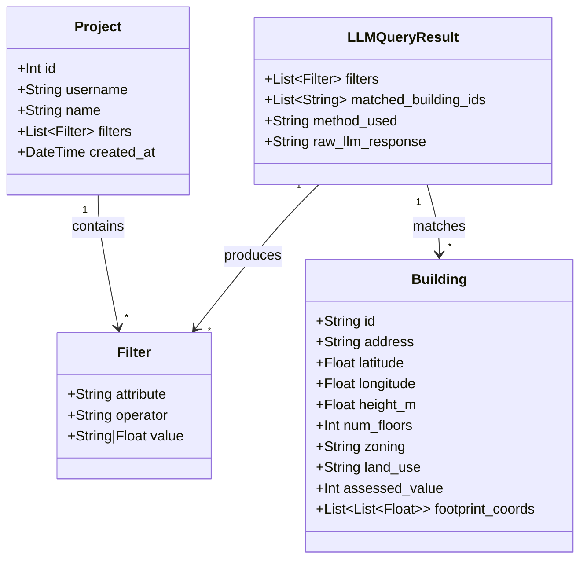
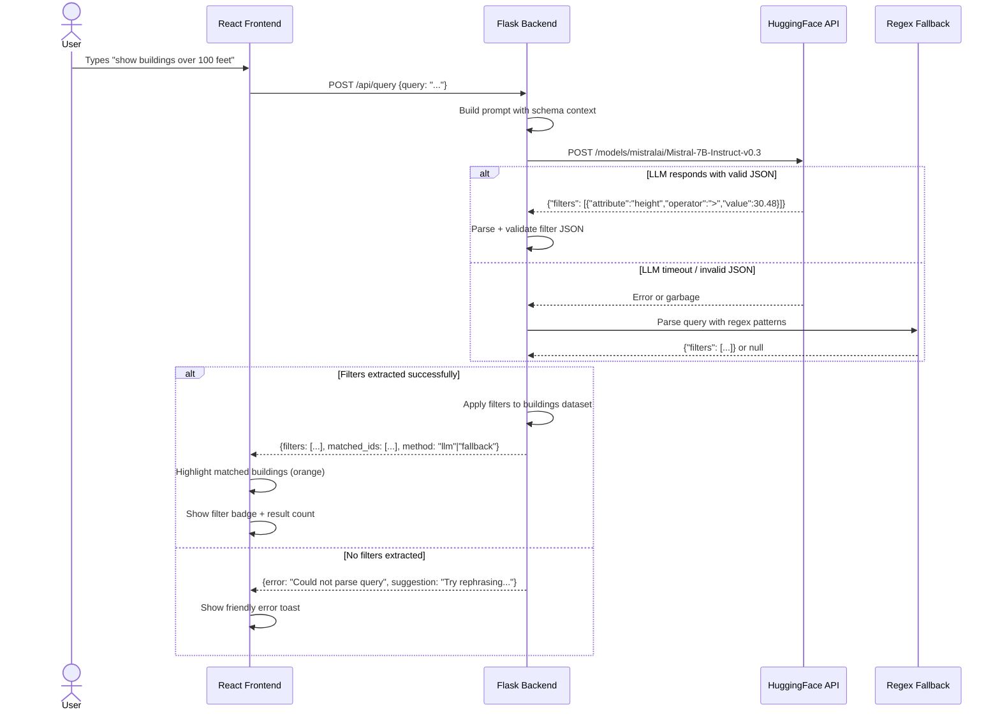

# Calgary 3D City Dashboard — Implementation Plan

> **For agentic workers:** REQUIRED SUB-SKILL: Use superpowers:subagent-driven-development (recommended) or superpowers:executing-plans to implement this plan task-by-task. Steps use checkbox (`- [ ]`) syntax for tracking.

**Goal:** Build a 3D interactive dashboard of Calgary's Beltline/downtown buildings with LLM-powered natural language querying and project persistence.

**Architecture:** Decoupled data ingestion → Flask API → React/Three.js frontend. A one-time `fetch_data.py` script pulls Calgary Open Data (Building Footprints + Property Assessments), joins by address, and caches to `data/buildings.json`. Flask serves this data, handles LLM queries via Hugging Face Inference API (with regex fallback), and persists user projects in SQLite. React frontend renders buildings as extruded 3D shapes using `@react-three/fiber` and provides query/save/load UI with shadcn/ui components.

**Tech Stack:** Flask, SQLite, SQLAlchemy, React 18, Vite, @react-three/fiber, @react-three/drei, shadcn/ui (Tailwind + Radix), LLM via abstracted client (HuggingFace or Groq, switchable by env var), Render (backend), Vercel (frontend)

**Commit cadence:** Commit after every checkbox step, not after each task.

---

## Architecture Diagram

```mermaid
graph TB
    subgraph "Data Ingestion (One-time)"
        A[scripts/fetch_data.py] -->|SODA API| B[Calgary Open Data]
        B -->|Building Footprints GeoJSON| A
        B -->|Property Assessments CSV| A
        A -->|Join by address| C[data/buildings.json]
    end

    subgraph "Backend (Flask + SQLite)"
        D[app.py] -->|loads on startup| C
        D --> E[routes/buildings.py<br/>GET /api/buildings]
        D --> F[routes/query.py<br/>POST /api/query]
        D --> G[routes/projects.py<br/>CRUD /api/projects]
        F --> H[llm.py]
        H -->|Primary| I[Hugging Face API]
        H -->|Fallback| J[Regex Parser]
        G --> K[(SQLite DB)]
    end

    subgraph "Frontend (React + Three.js)"
        L[App.jsx] --> M[CityScene.jsx<br/>@react-three/fiber Canvas]
        M --> N[Building meshes<br/>ExtrudeGeometry]
        L --> O[QueryInput.jsx<br/>shadcn/ui Input]
        L --> P[BuildingPopup.jsx<br/>Data card overlay]
        L --> Q[ProjectPanel.jsx<br/>Save/Load UI]
        L --> R[UserInput.jsx<br/>Username field]
    end

    E -->|JSON| L
    F -->|Filtered IDs + filter metadata| L
    G -->|Project list / saved filters| L
```

## Class Diagram



## Sequence Diagram — LLM Query Flow



---

## File Structure

```
masiv-dashboard/
├── backend/
│   ├── app.py                    # Flask app, CORS, startup loader
│   ├── config.py                 # Env vars, constants
│   ├── models.py                 # SQLAlchemy Project model
│   ├── llm.py                    # HF API client + regex fallback
│   ├── requirements.txt
│   ├── data/
│   │   └── buildings.json        # Pre-fetched cached building data
│   ├── scripts/
│   │   └── fetch_data.py         # One-time data ingestion script
│   └── routes/
│       ├── __init__.py
│       ├── buildings.py          # GET /api/buildings
│       ├── query.py              # POST /api/query
│       └── projects.py           # CRUD /api/projects
├── frontend/
│   ├── index.html
│   ├── package.json
│   ├── vite.config.js
│   ├── tailwind.config.js
│   ├── postcss.config.js
│   ├── components.json           # shadcn/ui config
│   └── src/
│       ├── main.jsx
│       ├── App.jsx               # Layout + state orchestration
│       ├── lib/
│       │   ├── api.js            # Axios/fetch wrapper
│       │   └── utils.js          # cn() helper for shadcn
│       ├── components/
│       │   ├── ui/               # shadcn/ui primitives (auto-generated)
│       │   ├── CityScene.jsx     # R3F Canvas + camera + lights + ground
│       │   ├── BuildingMesh.jsx  # Single building: Shape → ExtrudeGeometry
│       │   ├── BuildingPopup.jsx # HTML overlay card on click
│       │   ├── QueryInput.jsx    # Text input + submit + active filter badge
│       │   ├── ProjectPanel.jsx  # Save/load project list
│       │   ├── UserInput.jsx     # Username text field
│       │   └── LoadingScreen.jsx # Cold-start spinner
│       └── hooks/
│           ├── useBuildings.js   # Fetch + hold buildings state
│           └── useProjects.js    # CRUD projects state
├── docs/
│   └── uml/                     # Exported PNG diagrams for ZIP
├── PLAN.md
├── DEMO_SCRIPT.md
├── README.md
└── .env.example
```

---

## Database Schema (SQLite)

```sql
CREATE TABLE projects (
    id INTEGER PRIMARY KEY AUTOINCREMENT,
    username TEXT NOT NULL,
    name TEXT NOT NULL,
    filters_json TEXT NOT NULL,  -- JSON string: [{"attribute":"height","operator":">","value":30}]
    created_at TIMESTAMP DEFAULT CURRENT_TIMESTAMP
);

CREATE INDEX idx_projects_username ON projects(username);
```

One table. `filters_json` stores the array of filter objects as a JSON string. No separate users table — username is just a string column. This is intentionally simple per the brief.

---

## API Contract

### `GET /api/buildings`

Returns all cached building data.

**Response 200:**
```json
{
  "buildings": [
    {
      "id": "bldg_001",
      "address": "123 17 Ave SW",
      "latitude": 51.0381,
      "longitude": -114.0627,
      "height_m": 45.0,
      "num_floors": 12,
      "zoning": "CC-X",
      "land_use": "COMMERCIAL",
      "assessed_value": 2500000,
      "footprint": [[lng, lat], [lng, lat], ...]
    }
  ],
  "metadata": {
    "count": 47,
    "center": [51.0390, -114.0650],
    "bounds": {"sw": [51.035, -114.070], "ne": [51.043, -114.058]}
  }
}
```

### `POST /api/query`

Send a natural language query, get back filters and matching building IDs.

**Request:**
```json
{
  "query": "show buildings over 100 feet"
}
```

**Response 200:**
```json
{
  "filters": [
    {"attribute": "height_m", "operator": ">", "value": 30.48}
  ],
  "matched_ids": ["bldg_003", "bldg_017", "bldg_022"],
  "matched_count": 3,
  "method": "llm",
  "raw_query": "show buildings over 100 feet"
}
```

**Response 200 (parse failure):**
```json
{
  "filters": [],
  "matched_ids": [],
  "matched_count": 0,
  "method": "none",
  "error": "Could not interpret your query. Try something like: 'show buildings over 100 feet' or 'highlight commercial buildings'."
}
```

### `GET /api/projects?username={username}`

**Response 200:**
```json
{
  "projects": [
    {
      "id": 1,
      "name": "Tall Commercial",
      "filters": [{"attribute": "height_m", "operator": ">", "value": 30}],
      "created_at": "2026-04-11T14:30:00Z"
    }
  ]
}
```

### `POST /api/projects`

**Request:**
```json
{
  "username": "yuvi",
  "name": "My Analysis",
  "filters": [{"attribute": "height_m", "operator": ">", "value": 30}]
}
```

**Response 201:**
```json
{
  "id": 1,
  "message": "Project saved"
}
```

### `DELETE /api/projects/{id}`

**Response 200:**
```json
{
  "message": "Project deleted"
}
```

---

## LLM Prompt Design

```
<s>[INST] You are a building data filter assistant. Given a natural language query about city buildings, extract structured filters as JSON.

AVAILABLE ATTRIBUTES (use these exact names):
- height_m: Building height in meters (float). Note: 1 foot = 0.3048 meters.
- assessed_value: Property value in CAD dollars (integer). 
- zoning: Zoning code string (e.g., "CC-X", "CR20", "M-H1", "RC-G", "M-C1")
- land_use: One of "COMMERCIAL", "RESIDENTIAL", "MIXED USE", "INSTITUTIONAL"
- num_floors: Number of floors (integer)
- address: Street address (string)

VALID OPERATORS: ">", "<", ">=", "<=", "==", "!="

RULES:
- Convert feet to meters by multiplying by 0.3048
- Convert "million" to numeric (e.g., "$2 million" → 2000000)
- For zoning codes, use exact uppercase match with "==" operator
- For land_use, map common words: "commercial" → "COMMERCIAL", "residential" → "RESIDENTIAL"
- Multiple conditions = multiple filter objects in the array
- Return ONLY the JSON object, no explanation

EXAMPLES:
Query: "highlight buildings over 100 feet"
{"filters": [{"attribute": "height_m", "operator": ">", "value": 30.48}]}

Query: "show commercial buildings"
{"filters": [{"attribute": "land_use", "operator": "==", "value": "COMMERCIAL"}]}

Query: "show buildings in RC-G zoning"
{"filters": [{"attribute": "zoning", "operator": "==", "value": "RC-G"}]}

Query: "buildings less than $500,000 in value"
{"filters": [{"attribute": "assessed_value", "operator": "<", "value": 500000}]}

Query: "tall commercial buildings over 50 meters"
{"filters": [{"attribute": "height_m", "operator": ">", "value": 50}, {"attribute": "land_use", "operator": "==", "value": "COMMERCIAL"}]}

Now extract the filter for this query: {user_query} [/INST]
```

**Why this prompt design:**
- Uses Mistral's `[INST]` chat template for best results
- Exact attribute names match the data schema — no mapping needed on backend
- Includes unit conversion rules so the LLM handles feet→meters
- Few-shot examples cover the query types from the brief
- "Return ONLY JSON" reduces hallucination of explanatory text

---

## Regex Fallback Patterns

When LLM fails, these patterns catch the most common queries:

| Pattern | Regex | Extracted Filter |
|---------|-------|-----------------|
| Height comparison | `(over\|above\|greater than\|more than\|taller than)\s+(\d+)\s*(feet\|ft\|meters?\|m)?` | `height_m > value` (convert ft→m) |
| Height under | `(under\|below\|less than\|shorter than)\s+(\d+)\s*(feet\|ft\|meters?\|m)?` | `height_m < value` |
| Value comparison | `(over\|above\|more than\|greater than)\s*\$?([\d,]+)` | `assessed_value > value` |
| Value under | `(under\|below\|less than)\s*\$?([\d,]+)` | `assessed_value < value` |
| Zoning code | `\b(RC-G\|CC-X\|CR20\|M-H1\|M-C1\|C-COR\|CC-MH)\b` (case insensitive) | `zoning == CODE` |
| Land use | `\b(commercial\|residential\|mixed.?use\|institutional)\b` | `land_use == VALUE` |
| Floor count | `(over\|more than\|above)\s+(\d+)\s*(floors?\|stories?\|storeys?)` | `num_floors > value` |

---

## Phased Timeline

### Phase 1 — Data Pipeline (Friday 1:00 PM – 6:00 PM, ~5h)

> **Goal:** Working `fetch_data.py` that produces a valid `data/buildings.json` with 30-60 Beltline buildings.
>
> **CHECKPOINT @ hour 3 (4:00 PM):** If fewer than 15 buildings have been successfully joined from real data, immediately switch to the synthetic-data fallback (Task 2B below). Do not spend more time debugging API joins.

---

#### Task 1: Backend project scaffolding

**Files:**
- Create: `backend/requirements.txt`
- Create: `backend/config.py`
- Create: `backend/app.py` (minimal)
- Create: `backend/.env.example`

- [ ] **Step 1: Create backend directory and requirements.txt**

```
backend/requirements.txt
```
```
flask==3.1.0
flask-cors==5.0.1
flask-sqlalchemy==3.1.1
requests==2.32.3
huggingface-hub==0.27.1
python-dotenv==1.0.1
gunicorn==23.0.0
```

- [ ] **Step 2: Create config.py**

```python
# backend/config.py
import os
from dotenv import load_dotenv

load_dotenv()

HF_API_TOKEN = os.getenv("HF_API_TOKEN")
HF_MODEL = os.getenv("HF_MODEL", "mistralai/Mistral-7B-Instruct-v0.3")
DATABASE_URL = os.getenv("DATABASE_URL", "sqlite:///projects.db")
FRONTEND_URL = os.getenv("FRONTEND_URL", "http://localhost:5173")

# Beltline bounding box (SW corner to NE corner)
BELTLINE_BOUNDS = {
    "sw_lat": 51.035,
    "sw_lng": -114.085,
    "ne_lat": 51.048,
    "ne_lng": -114.055,
}
```

- [ ] **Step 3: Create .env.example**

```
HF_API_TOKEN=hf_your_token_here
HF_MODEL=mistralai/Mistral-7B-Instruct-v0.3
FRONTEND_URL=http://localhost:5173
```

- [ ] **Step 4: Create minimal app.py to verify Flask runs**

```python
# backend/app.py
from flask import Flask, jsonify
from flask_cors import CORS
from config import FRONTEND_URL

app = Flask(__name__)
CORS(app, origins=[FRONTEND_URL])

@app.route("/api/health")
def health():
    return jsonify({"status": "ok"})

if __name__ == "__main__":
    app.run(debug=True, port=5000)
```

- [ ] **Step 5: Set up venv, install deps, verify Flask starts**

```bash
cd backend
python3 -m venv venv
source venv/bin/activate
pip install -r requirements.txt
python app.py
# Visit http://localhost:5000/api/health → {"status": "ok"}
# Ctrl+C
```

- [ ] **Step 6: Commit**

```bash
git add backend/
git commit -m "feat: scaffold Flask backend with config and health endpoint"
```

---

#### Task 2: Data ingestion script — fetch_data.py

**Files:**
- Create: `backend/scripts/fetch_data.py`
- Create: `backend/data/` (directory)

This is the riskiest task. Calgary's SODA API may have quirks. Budget extra time here.

- [ ] **Step 1: Research the actual API endpoints**

Before writing code, verify the endpoints work by hitting them in the browser or with curl:

```bash
# Building Footprints (GeoJSON via SODA)
curl -s "https://data.calgary.ca/resource/cchr-krqg.geojson?\$where=within_box(multipolygon, 51.048, -114.085, 51.035, -114.055)&\$limit=100" | python3 -m json.tool | head -50

# Property Assessments (current year)
curl -s "https://data.calgary.ca/resource/4jnh-bu79.json?\$where=comm_name='BELTLINE'&\$limit=10" | python3 -m json.tool | head -50
```

Inspect the response fields. Note the exact field names for: address, assessed value, land use, zoning. Adjust the script accordingly.

**IMPORTANT:** If the GeoJSON spatial query doesn't work with `within_box`, try alternative approaches:
- Filter by `comm_code` or community name instead of bounding box
- Download full dataset and filter locally
- Use a different geometry column name (check the API docs page for the dataset)

- [ ] **Step 2: Write fetch_data.py**

```python
#!/usr/bin/env python3
"""
One-time data ingestion script.
Fetches Calgary Building Footprints + Property Assessments,
joins by address, and saves to data/buildings.json.

Usage: python scripts/fetch_data.py
"""
import json
import hashlib
import os
import sys
import requests

# Calgary Open Data SODA API endpoints
FOOTPRINTS_URL = "https://data.calgary.ca/resource/cchr-krqg.geojson"
ASSESSMENTS_URL = "https://data.calgary.ca/resource/4jnh-bu79.json"

# Beltline / Downtown Core bounding box
BOUNDS = {
    "sw_lat": 51.035,
    "sw_lng": -114.085,
    "ne_lat": 51.048,
    "ne_lng": -114.055,
}

OUTPUT_PATH = os.path.join(os.path.dirname(__file__), "..", "data", "buildings.json")


def fetch_footprints():
    """Fetch building footprints within the Beltline bounding box."""
    print("Fetching building footprints...")
    
    # Try spatial query first
    params = {
        "$limit": 200,
        "$where": f"within_box(multipolygon, {BOUNDS['ne_lat']}, {BOUNDS['sw_lng']}, {BOUNDS['sw_lat']}, {BOUNDS['ne_lng']})"
    }
    
    resp = requests.get(FOOTPRINTS_URL, params=params, timeout=30)
    
    if resp.status_code != 200:
        print(f"Spatial query failed ({resp.status_code}), trying community filter...")
        # Fallback: filter by community name
        params = {
            "$limit": 200,
            "$where": "comm_code='BEL'"  # Beltline community code
        }
        resp = requests.get(FOOTPRINTS_URL.replace(".geojson", ".json"), params=params, timeout=30)
        resp.raise_for_status()
    
    data = resp.json()
    
    if "features" in data:
        features = data["features"]
    elif isinstance(data, list):
        features = data
    else:
        features = []
    
    print(f"  Got {len(features)} footprints")
    return features


def fetch_assessments():
    """Fetch property assessments for Beltline."""
    print("Fetching property assessments...")
    
    params = {
        "$limit": 500,
        "$where": "comm_name='BELTLINE'",
    }
    
    resp = requests.get(ASSESSMENTS_URL, params=params, timeout=30)
    resp.raise_for_status()
    assessments = resp.json()
    
    print(f"  Got {len(assessments)} assessments")
    return assessments


def normalize_address(addr):
    """Normalize address string for matching."""
    if not addr:
        return ""
    return addr.upper().strip().replace(".", "").replace(",", "")


def compute_centroid(coords):
    """Compute centroid of a polygon ring."""
    if not coords:
        return (0, 0)
    lngs = [c[0] for c in coords]
    lats = [c[1] for c in coords]
    return (sum(lats) / len(lats), sum(lngs) / len(lngs))


def extract_footprint_coords(geometry):
    """Extract the outer ring coordinates from GeoJSON geometry."""
    if not geometry:
        return []
    
    geom_type = geometry.get("type", "")
    coords = geometry.get("coordinates", [])
    
    if geom_type == "Polygon":
        return coords[0] if coords else []
    elif geom_type == "MultiPolygon":
        # Take the largest polygon
        if not coords:
            return []
        largest = max(coords, key=lambda p: len(p[0]) if p else 0)
        return largest[0] if largest else []
    return []


def join_and_build(footprints, assessments):
    """Join footprints with assessments by address. Build final building objects."""
    
    # Index assessments by normalized address
    assess_map = {}
    for a in assessments:
        # Field names vary — try common variations
        addr = a.get("address") or a.get("location_address") or a.get("loc_address") or ""
        key = normalize_address(addr)
        if key:
            assess_map[key] = a
    
    buildings = []
    unmatched = 0
    
    for i, feat in enumerate(footprints):
        props = feat.get("properties", feat) if isinstance(feat, dict) else {}
        geometry = feat.get("geometry", {})
        
        # Extract address from footprint
        fp_addr = props.get("address") or props.get("ADDRESS") or ""
        addr_key = normalize_address(fp_addr)
        
        # Try to match with assessment
        assessment = assess_map.get(addr_key, {})
        
        if not assessment:
            unmatched += 1
        
        # Extract footprint coordinates
        footprint_coords = extract_footprint_coords(geometry)
        if not footprint_coords:
            continue
        
        centroid = compute_centroid(footprint_coords)
        
        # Height: try assessment num_floors, fallback to default
        num_floors = None
        for key in ["num_floors", "number_of_floors", "bldg_floors"]:
            val = assessment.get(key) or props.get(key) or props.get(key.upper())
            if val:
                try:
                    num_floors = int(float(val))
                except (ValueError, TypeError):
                    pass
                break
        
        if num_floors is None:
            num_floors = 3  # Default for Beltline low-rise
        
        height_m = num_floors * 3.5  # Documented fallback
        
        # Assessed value
        assessed_value = 0
        for key in ["assessed_value", "current_assessed_value", "roll_assessed_value"]:
            val = assessment.get(key)
            if val:
                try:
                    assessed_value = int(float(str(val).replace(",", "").replace("$", "")))
                except (ValueError, TypeError):
                    pass
                break
        
        # Zoning
        zoning = assessment.get("zoning") or props.get("zoning") or props.get("ZONING") or "UNKNOWN"
        
        # Land use
        land_use_raw = assessment.get("land_use") or assessment.get("property_type") or props.get("land_use") or ""
        land_use = categorize_land_use(str(land_use_raw).upper())
        
        # Generate stable ID from address or index
        bldg_id = f"bldg_{hashlib.md5(f'{fp_addr}_{i}'.encode()).hexdigest()[:8]}"
        
        buildings.append({
            "id": bldg_id,
            "address": fp_addr or f"Building {i+1}",
            "latitude": centroid[0],
            "longitude": centroid[1],
            "height_m": height_m,
            "num_floors": num_floors,
            "zoning": str(zoning).upper().strip(),
            "land_use": land_use,
            "assessed_value": assessed_value,
            "footprint": footprint_coords,
        })
    
    print(f"  Built {len(buildings)} buildings ({unmatched} unmatched assessments)")
    return buildings


def categorize_land_use(raw):
    """Map raw land use strings to standard categories."""
    if not raw:
        return "UNKNOWN"
    if any(w in raw for w in ["COMMERC", "RETAIL", "OFFICE"]):
        return "COMMERCIAL"
    if any(w in raw for w in ["RESIDEN", "DWELLING", "APARTMENT", "CONDO"]):
        return "RESIDENTIAL"
    if any(w in raw for w in ["MIXED", "MULTI"]):
        return "MIXED USE"
    if any(w in raw for w in ["INSTIT", "GOVERN", "SCHOOL", "CHURCH"]):
        return "INSTITUTIONAL"
    return "COMMERCIAL"  # Beltline default


def main():
    footprints = fetch_footprints()
    assessments = fetch_assessments()
    buildings = join_and_build(footprints, assessments)
    
    if len(buildings) < 10:
        print(f"\nWARNING: Only {len(buildings)} buildings found. Expected 30-60.")
        print("You may need to adjust the bounding box or address matching logic.")
    
    # Compute metadata
    all_lats = [b["latitude"] for b in buildings]
    all_lngs = [b["longitude"] for b in buildings]
    center = [sum(all_lats) / len(all_lats), sum(all_lngs) / len(all_lngs)]
    
    output = {
        "buildings": buildings,
        "metadata": {
            "count": len(buildings),
            "center": center,
            "bounds": {
                "sw": [min(all_lats), min(all_lngs)],
                "ne": [max(all_lats), max(all_lngs)],
            },
            "data_sources": [
                "Calgary Open Data: Building Footprints (cchr-krqg)",
                "Calgary Open Data: Property Assessments (4jnh-bu79)",
            ],
            "height_method": "num_floors * 3.5m (documented fallback)",
        },
    }
    
    os.makedirs(os.path.dirname(OUTPUT_PATH), exist_ok=True)
    with open(OUTPUT_PATH, "w") as f:
        json.dump(output, f, indent=2)
    
    print(f"\nSaved to {OUTPUT_PATH}")
    print(f"Total buildings: {len(buildings)}")
    print(f"Height range: {min(b['height_m'] for b in buildings):.1f}m - {max(b['height_m'] for b in buildings):.1f}m")
    print(f"Zoning types: {sorted(set(b['zoning'] for b in buildings))}")
    print(f"Land use types: {sorted(set(b['land_use'] for b in buildings))}")


if __name__ == "__main__":
    main()
```

- [ ] **Step 3: Run the script and inspect output**

```bash
cd backend
mkdir -p data
python scripts/fetch_data.py
```

Expected: `data/buildings.json` with 30-60 buildings. If fewer than 10, debug the API response (print raw JSON) and adjust:
- Bounding box coordinates
- Address normalization for matching
- API field names

**Likely issue:** The footprints and assessments may use different address formats. If join rate is low, try fuzzy matching on street number + street name only (strip direction suffixes, unit numbers).

- [ ] **Step 4: Validate the data file**

```bash
python3 -c "
import json
with open('data/buildings.json') as f:
    data = json.load(f)
b = data['buildings'][0]
print(json.dumps(b, indent=2))
print(f\"Total: {data['metadata']['count']}\")
assert len(data['buildings']) >= 10, 'Too few buildings'
assert all(b['footprint'] for b in data['buildings']), 'Missing footprints'
print('Data validation passed')
"
```

- [ ] **Step 5: Commit**

```bash
git add backend/scripts/fetch_data.py backend/data/buildings.json
git commit -m "feat: add data ingestion script, cache 30-60 Beltline buildings"
```

---

#### Task 2B: Synthetic data fallback (ONLY if checkpoint fails)

> **Trigger:** Use this task ONLY if the hour-3 checkpoint shows <15 joined buildings. Skip entirely if real data join succeeded.

**Files:**
- Create: `backend/scripts/generate_synthetic.py`
- Overwrite: `backend/data/buildings.json`

- [ ] **Step 1: Write synthetic data generator**

```python
#!/usr/bin/env python3
"""
Synthetic building data fallback for Beltline area.
Used when Calgary Open Data join produces too few results.
Generates realistic buildings with varied heights, zoning, and values.
"""
import json
import random
import os

random.seed(42)  # Reproducible

OUTPUT_PATH = os.path.join(os.path.dirname(__file__), "..", "data", "buildings.json")

# Beltline center and block grid
CENTER_LAT = 51.0405
CENTER_LNG = -114.0670
BLOCK_SIZE_LAT = 0.0009  # ~100m
BLOCK_SIZE_LNG = 0.0012  # ~85m

ZONING_TYPES = ["CC-X", "CR20", "M-H1", "M-C1", "RC-G", "C-COR"]
LAND_USE_MAP = {
    "CC-X": "COMMERCIAL", "CR20": "COMMERCIAL", "C-COR": "COMMERCIAL",
    "M-H1": "RESIDENTIAL", "M-C1": "MIXED USE", "RC-G": "RESIDENTIAL",
}

STREETS = [
    "17 Ave SW", "16 Ave SW", "15 Ave SW", "14 Ave SW",
    "1 St SW", "2 St SW", "3 St SW", "4 St SW", "5 St SW",
]


def make_footprint(lat, lng, width_m=20, depth_m=15):
    """Create a rectangular footprint polygon."""
    dlat = width_m / 111320
    dlng = depth_m / (111320 * 0.6293)  # cos(51)
    return [
        [lng - dlng/2, lat - dlat/2],
        [lng + dlng/2, lat - dlat/2],
        [lng + dlng/2, lat + dlat/2],
        [lng - dlng/2, lat + dlat/2],
        [lng - dlng/2, lat - dlat/2],  # close ring
    ]


def main():
    buildings = []
    idx = 0

    for block_row in range(-2, 2):  # 4 rows
        for block_col in range(-2, 3):  # 5 cols
            n_buildings = random.randint(2, 4)
            for b in range(n_buildings):
                idx += 1
                lat = CENTER_LAT + block_row * BLOCK_SIZE_LAT + random.uniform(-0.0003, 0.0003)
                lng = CENTER_LNG + block_col * BLOCK_SIZE_LNG + random.uniform(-0.0004, 0.0004)

                zoning = random.choice(ZONING_TYPES)
                land_use = LAND_USE_MAP[zoning]

                # Height distribution: mostly low-rise, some towers
                if random.random() < 0.15:
                    num_floors = random.randint(15, 40)  # Tower
                elif random.random() < 0.4:
                    num_floors = random.randint(6, 14)   # Mid-rise
                else:
                    num_floors = random.randint(2, 5)     # Low-rise

                height_m = round(num_floors * 3.5, 1)
                assessed_value = int(num_floors * random.randint(80000, 250000))
                street = random.choice(STREETS)
                address = f"{random.randint(100, 999)} {street}"

                width = random.uniform(15, 35)
                depth = random.uniform(12, 28)

                buildings.append({
                    "id": f"bldg_{idx:03d}",
                    "address": address,
                    "latitude": round(lat, 6),
                    "longitude": round(lng, 6),
                    "height_m": height_m,
                    "num_floors": num_floors,
                    "zoning": zoning,
                    "land_use": land_use,
                    "assessed_value": assessed_value,
                    "footprint": make_footprint(lat, lng, width, depth),
                })

    all_lats = [b["latitude"] for b in buildings]
    all_lngs = [b["longitude"] for b in buildings]

    output = {
        "buildings": buildings,
        "metadata": {
            "count": len(buildings),
            "center": [sum(all_lats)/len(all_lats), sum(all_lngs)/len(all_lngs)],
            "bounds": {
                "sw": [min(all_lats), min(all_lngs)],
                "ne": [max(all_lats), max(all_lngs)],
            },
            "data_sources": ["Synthetic data based on Beltline demographics (fallback)"],
            "height_method": "num_floors * 3.5m",
            "note": "Real Calgary Open Data join produced <15 buildings. Synthetic data used with realistic Beltline parameters. See README for details.",
        },
    }

    os.makedirs(os.path.dirname(OUTPUT_PATH), exist_ok=True)
    with open(OUTPUT_PATH, "w") as f:
        json.dump(output, f, indent=2)

    print(f"Generated {len(buildings)} synthetic buildings")
    print(f"Zoning: {sorted(set(b['zoning'] for b in buildings))}")
    print(f"Heights: {min(b['height_m'] for b in buildings)}m - {max(b['height_m'] for b in buildings)}m")


if __name__ == "__main__":
    main()
```

- [ ] **Step 2: Run generator and validate output**

```bash
python scripts/generate_synthetic.py
python3 -c "
import json
with open('data/buildings.json') as f:
    d = json.load(f)
print(f'Buildings: {d[\"metadata\"][\"count\"]}')
assert d['metadata']['count'] >= 30
print('Synthetic data validated')
"
```

- [ ] **Step 3: Commit**

```bash
git add backend/scripts/generate_synthetic.py backend/data/buildings.json
git commit -m "feat: add synthetic data fallback for Beltline buildings"
```

---

#### Task 2.5: Verify LLM API + abstract provider (~10 min)

> **Goal:** Confirm HF token works. If not, swap to Groq. Abstract the client so provider is one env var (`LLM_PROVIDER=huggingface|groq`).

**Files:**
- Modify: `backend/config.py`
- Modify: `backend/requirements.txt`

- [ ] **Step 1: Test HF API with your token**

```bash
cd backend && source venv/bin/activate
python3 -c "
import os, requests
from dotenv import load_dotenv
load_dotenv()
token = os.getenv('HF_API_TOKEN')
print(f'Token: {token[:10]}...' if token else 'NO TOKEN SET')
resp = requests.post(
    'https://api-inference.huggingface.co/models/mistralai/Mistral-7B-Instruct-v0.3',
    headers={'Authorization': f'Bearer {token}'},
    json={'inputs': '<s>[INST] Say hello [/INST]', 'parameters': {'max_new_tokens': 20}},
    timeout=30
)
print(f'Status: {resp.status_code}')
print(f'Response: {resp.text[:200]}')
if resp.status_code == 200:
    print('HF API WORKS — use huggingface provider')
else:
    print('HF API FAILED — switch to groq provider')
"
```

- [ ] **Step 2: Update config.py with provider abstraction**

```python
# backend/config.py
import os
from dotenv import load_dotenv

load_dotenv()

# LLM Provider: "huggingface" or "groq"
LLM_PROVIDER = os.getenv("LLM_PROVIDER", "huggingface")

# HuggingFace settings
HF_API_TOKEN = os.getenv("HF_API_TOKEN")
HF_MODEL = os.getenv("HF_MODEL", "mistralai/Mistral-7B-Instruct-v0.3")

# Groq settings (fallback provider)
GROQ_API_KEY = os.getenv("GROQ_API_KEY")
GROQ_MODEL = os.getenv("GROQ_MODEL", "llama-3.3-70b-versatile")

DATABASE_URL = os.getenv("DATABASE_URL", "sqlite:///projects.db")
FRONTEND_URL = os.getenv("FRONTEND_URL", "http://localhost:5173")

# Beltline bounding box (SW corner to NE corner)
BELTLINE_BOUNDS = {
    "sw_lat": 51.035,
    "sw_lng": -114.085,
    "ne_lat": 51.048,
    "ne_lng": -114.055,
}
```

- [ ] **Step 3: Update .env.example and requirements.txt**

Add to `.env.example`:
```
LLM_PROVIDER=huggingface
# If using Groq instead:
# LLM_PROVIDER=groq
# GROQ_API_KEY=gsk_your_key_here
# GROQ_MODEL=llama-3.3-70b-versatile
```

Add `groq>=0.12.0` to `requirements.txt` and `pip install groq`.

- [ ] **Step 4: Commit**

```bash
git add backend/config.py backend/requirements.txt backend/.env.example
git commit -m "feat: abstract LLM provider (huggingface or groq via env var)"
```

---

### Phase 2 — Backend Core (Friday 6:00 PM – 11:00 PM, ~5h)

> **Goal:** Fully working Flask API with all endpoints, LLM integration (provider-abstracted), regex fallback, and SQLite persistence.

---

#### Task 3: SQLAlchemy model + database setup

**Files:**
- Create: `backend/models.py`
- Modify: `backend/app.py`

- [ ] **Step 1: Create models.py**

```python
# backend/models.py
from flask_sqlalchemy import SQLAlchemy
from datetime import datetime, timezone

db = SQLAlchemy()


class Project(db.Model):
    __tablename__ = "projects"

    id = db.Column(db.Integer, primary_key=True, autoincrement=True)
    username = db.Column(db.String(100), nullable=False, index=True)
    name = db.Column(db.String(200), nullable=False)
    filters_json = db.Column(db.Text, nullable=False)  # JSON string
    created_at = db.Column(
        db.DateTime, default=lambda: datetime.now(timezone.utc)
    )

    def to_dict(self):
        import json
        return {
            "id": self.id,
            "name": self.name,
            "filters": json.loads(self.filters_json),
            "created_at": self.created_at.isoformat() + "Z",
        }
```

- [ ] **Step 2: Update app.py to initialize DB and load buildings data**

```python
# backend/app.py
import json
import os
from flask import Flask, jsonify
from flask_cors import CORS
from config import FRONTEND_URL, DATABASE_URL
from models import db

# Global buildings cache
BUILDINGS_DATA = {"buildings": [], "metadata": {}}


def load_buildings():
    """Load pre-fetched buildings data into memory."""
    global BUILDINGS_DATA
    data_path = os.path.join(os.path.dirname(__file__), "data", "buildings.json")
    if os.path.exists(data_path):
        with open(data_path) as f:
            BUILDINGS_DATA = json.load(f)
        print(f"Loaded {BUILDINGS_DATA['metadata']['count']} buildings")
    else:
        print("WARNING: data/buildings.json not found. Run scripts/fetch_data.py first.")


def create_app():
    app = Flask(__name__)
    app.config["SQLALCHEMY_DATABASE_URI"] = DATABASE_URL
    app.config["SQLALCHEMY_TRACK_MODIFICATIONS"] = False

    CORS(app, origins=[FRONTEND_URL, "http://localhost:5173"])
    db.init_app(app)

    with app.app_context():
        db.create_all()

    # Register blueprints
    from routes.buildings import buildings_bp
    from routes.query import query_bp
    from routes.projects import projects_bp

    app.register_blueprint(buildings_bp)
    app.register_blueprint(query_bp)
    app.register_blueprint(projects_bp)

    @app.route("/api/health")
    def health():
        return jsonify({"status": "ok", "buildings_loaded": len(BUILDINGS_DATA["buildings"])})

    load_buildings()
    return app


app = create_app()

if __name__ == "__main__":
    app.run(debug=True, port=5000)
```

- [ ] **Step 3: Create routes/__init__.py**

```python
# backend/routes/__init__.py
```

(Empty file — just makes it a package.)

- [ ] **Step 4: Verify DB creates on startup**

```bash
cd backend
python -c "from app import app; print('DB created')"
ls -la instance/  # Should see projects.db
```

- [ ] **Step 5: Commit**

```bash
git add backend/models.py backend/app.py backend/routes/__init__.py
git commit -m "feat: add SQLAlchemy Project model and DB init"
```

---

#### Task 4: Buildings endpoint

**Files:**
- Create: `backend/routes/buildings.py`

- [ ] **Step 1: Create buildings route**

```python
# backend/routes/buildings.py
from flask import Blueprint, jsonify

buildings_bp = Blueprint("buildings", __name__)


@buildings_bp.route("/api/buildings")
def get_buildings():
    from app import BUILDINGS_DATA
    return jsonify(BUILDINGS_DATA)
```

- [ ] **Step 2: Test it**

```bash
cd backend
python app.py &
curl -s http://localhost:5000/api/buildings | python3 -m json.tool | head -30
kill %1
```

Expected: JSON with buildings array and metadata.

- [ ] **Step 3: Commit**

```bash
git add backend/routes/buildings.py
git commit -m "feat: add GET /api/buildings endpoint"
```

---

#### Task 5: LLM integration + regex fallback (provider-abstracted)

**Files:**
- Create: `backend/llm.py`

- [ ] **Step 1: Write llm.py with abstracted LLM client (HF or Groq), regex fallback, and filter applicator**

```python
# backend/llm.py
import json
import re
import logging
import requests
from config import LLM_PROVIDER, HF_API_TOKEN, HF_MODEL, GROQ_API_KEY, GROQ_MODEL

logger = logging.getLogger(__name__)

HF_API_URL = f"https://api-inference.huggingface.co/models/{HF_MODEL}"

SYSTEM_PROMPT = """You are a building data filter assistant. Given a natural language query about city buildings, extract structured filters as JSON.

AVAILABLE ATTRIBUTES (use these exact names):
- height_m: Building height in meters (float). Note: 1 foot = 0.3048 meters.
- assessed_value: Property value in CAD dollars (integer).
- zoning: Zoning code string (e.g., "CC-X", "CR20", "M-H1", "RC-G", "M-C1")
- land_use: One of "COMMERCIAL", "RESIDENTIAL", "MIXED USE", "INSTITUTIONAL"
- num_floors: Number of floors (integer)
- address: Street address (string)

VALID OPERATORS: ">", "<", ">=", "<=", "==", "!="

RULES:
- Convert feet to meters by multiplying by 0.3048
- Convert "million" to numeric (e.g., "$2 million" -> 2000000)
- For zoning codes, use exact uppercase match with "==" operator
- For land_use, map: "commercial" -> "COMMERCIAL", "residential" -> "RESIDENTIAL"
- Multiple conditions = multiple filter objects in the array
- Return ONLY the JSON object, no explanation text"""

FEW_SHOT_EXAMPLES = [
    ('highlight buildings over 100 feet', '{"filters": [{"attribute": "height_m", "operator": ">", "value": 30.48}]}'),
    ('show commercial buildings', '{"filters": [{"attribute": "land_use", "operator": "==", "value": "COMMERCIAL"}]}'),
    ('show buildings in RC-G zoning', '{"filters": [{"attribute": "zoning", "operator": "==", "value": "RC-G"}]}'),
    ('buildings less than $500,000', '{"filters": [{"attribute": "assessed_value", "operator": "<", "value": 500000}]}'),
]


def _build_prompt(user_query):
    """Build the LLM prompt (shared between providers)."""
    examples_text = "\n".join(
        f"Query: \"{q}\"\n{a}" for q, a in FEW_SHOT_EXAMPLES
    )
    return f"{SYSTEM_PROMPT}\n\nEXAMPLES:\n{examples_text}\n\nNow extract the filter for this query: {user_query}"


def query_llm(user_query):
    """
    Try LLM first (provider from env), fall back to regex parser.
    Returns: (filters_list, method_used, raw_response_or_None)
    """
    # Attempt 1: LLM (provider-abstracted)
    if LLM_PROVIDER == "groq":
        filters, raw = _call_groq(user_query)
    else:
        filters, raw = _call_huggingface(user_query)

    if filters is not None:
        return filters, "llm", raw

    logger.info(f"LLM ({LLM_PROVIDER}) failed, trying regex fallback")

    # Attempt 2: Regex
    filters = _regex_parse(user_query)
    if filters is not None:
        return filters, "fallback", None

    # Both failed
    return None, "none", None


def _call_groq(user_query):
    """Call Groq API (OpenAI-compatible). Returns (filters, raw_response) or (None, None)."""
    if not GROQ_API_KEY:
        logger.warning("No GROQ_API_KEY set, skipping LLM")
        return None, None

    try:
        from groq import Groq
        client = Groq(api_key=GROQ_API_KEY)

        prompt = _build_prompt(user_query)
        response = client.chat.completions.create(
            model=GROQ_MODEL,
            messages=[
                {"role": "system", "content": SYSTEM_PROMPT},
                {"role": "user", "content": f"Extract the filter for this query: {user_query}"},
            ],
            temperature=0.1,
            max_tokens=200,
        )

        raw_text = response.choices[0].message.content
        filters = _extract_json_filters(raw_text)
        return filters, raw_text

    except Exception as e:
        logger.warning(f"Groq API error: {e}")
        return None, None


def _call_huggingface(user_query):
    """Call HF Inference API. Returns (filters, raw_response) or (None, None)."""
    if not HF_API_TOKEN:
        logger.warning("No HF_API_TOKEN set, skipping LLM")
        return None, None

    # Build prompt with Mistral [INST] template
    prompt_body = _build_prompt(user_query)
    prompt = f"<s>[INST] {prompt_body} [/INST]"

    headers = {"Authorization": f"Bearer {HF_API_TOKEN}"}
    payload = {
        "inputs": prompt,
        "parameters": {
            "max_new_tokens": 200,
            "temperature": 0.1,
            "return_full_text": False,
        },
    }

    try:
        resp = requests.post(HF_API_URL, headers=headers, json=payload, timeout=15)

        if resp.status_code == 503:
            logger.warning("HF model loading (503), falling back")
            return None, None

        resp.raise_for_status()
        result = resp.json()

        # HF returns list of generated texts
        if isinstance(result, list) and len(result) > 0:
            raw_text = result[0].get("generated_text", "")
        elif isinstance(result, dict):
            raw_text = result.get("generated_text", "")
        else:
            return None, None

        # Extract JSON from response (may have surrounding text)
        filters = _extract_json_filters(raw_text)
        return filters, raw_text

    except requests.exceptions.Timeout:
        logger.warning("HF API timeout")
        return None, None
    except requests.exceptions.RequestException as e:
        logger.warning(f"HF API error: {e}")
        return None, None


def _extract_json_filters(text):
    """Extract filters array from LLM response text."""
    # Try to find JSON object in the text
    match = re.search(r'\{[^{}]*"filters"\s*:\s*\[.*?\]\s*\}', text, re.DOTALL)
    if not match:
        return None

    try:
        parsed = json.loads(match.group())
        filters = parsed.get("filters", [])
        if not isinstance(filters, list):
            return None
        # Validate each filter
        valid = []
        for f in filters:
            if all(k in f for k in ("attribute", "operator", "value")):
                if f["attribute"] in ("height_m", "assessed_value", "zoning", "land_use", "num_floors", "address"):
                    if f["operator"] in (">", "<", ">=", "<=", "==", "!="):
                        valid.append(f)
        return valid if valid else None
    except (json.JSONDecodeError, KeyError):
        return None


def _regex_parse(query):
    """Regex-based fallback parser for common query patterns."""
    query_lower = query.lower().strip()
    filters = []

    # Height comparisons (feet or meters)
    height_over = re.search(
        r'(?:over|above|greater than|more than|taller than|exceeding)\s+(\d+(?:\.\d+)?)\s*(?:feet|ft|foot|meters?|m)?\b',
        query_lower
    )
    if height_over:
        val = float(height_over.group(1))
        # If query mentions feet/ft, convert; otherwise assume meters if > 100, feet if stated
        if re.search(r'(?:feet|ft|foot)', query_lower):
            val *= 0.3048
        elif val > 100:
            val *= 0.3048  # Likely feet if large number
        filters.append({"attribute": "height_m", "operator": ">", "value": round(val, 2)})

    height_under = re.search(
        r'(?:under|below|less than|shorter than)\s+(\d+(?:\.\d+)?)\s*(?:feet|ft|foot|meters?|m)?\b',
        query_lower
    )
    if height_under and not height_over:
        val = float(height_under.group(1))
        if re.search(r'(?:feet|ft|foot)', query_lower):
            val *= 0.3048
        elif val > 100:
            val *= 0.3048
        filters.append({"attribute": "height_m", "operator": "<", "value": round(val, 2)})

    # Value comparisons
    val_over = re.search(
        r'(?:over|above|more than|greater than|exceeding)\s*\$?\s*([\d,]+(?:\.\d+)?)\s*(?:million|mil|m)?\s*(?:in value|value|worth|dollars?|\$)?',
        query_lower
    )
    if val_over and not height_over:  # Don't confuse with height
        val_str = val_over.group(1).replace(",", "")
        val = float(val_str)
        if re.search(r'(?:million|mil\b)', query_lower):
            val *= 1_000_000
        if val >= 1000:  # Looks like a dollar amount
            filters.append({"attribute": "assessed_value", "operator": ">", "value": int(val)})

    val_under = re.search(
        r'(?:under|below|less than)\s*\$?\s*([\d,]+(?:\.\d+)?)\s*(?:million|mil|m)?\s*(?:in value|value|worth|dollars?|\$)?',
        query_lower
    )
    if val_under and not height_under:
        val_str = val_under.group(1).replace(",", "")
        val = float(val_str)
        if re.search(r'(?:million|mil\b)', query_lower):
            val *= 1_000_000
        if val >= 1000:
            filters.append({"attribute": "assessed_value", "operator": "<", "value": int(val)})

    # Zoning codes
    zoning_match = re.search(
        r'\b(RC-G|CC-X|CR20|CR-20|M-H1|M-C1|M-C2|C-COR|CC-MH|CC-ET|CC-EMU|DC|S-CI|S-CRI)\b',
        query, re.IGNORECASE
    )
    if zoning_match:
        filters.append({"attribute": "zoning", "operator": "==", "value": zoning_match.group(1).upper()})

    # Land use
    land_use_match = re.search(r'\b(commercial|residential|mixed[\s-]?use|institutional)\b', query_lower)
    if land_use_match:
        land_use_val = land_use_match.group(1).upper().replace("-", " ").replace("  ", " ")
        filters.append({"attribute": "land_use", "operator": "==", "value": land_use_val})

    # Floor count
    floors_match = re.search(
        r'(?:over|more than|above|greater than)\s+(\d+)\s*(?:floors?|stories?|storeys?|levels?)',
        query_lower
    )
    if floors_match:
        filters.append({"attribute": "num_floors", "operator": ">", "value": int(floors_match.group(1))})

    return filters if filters else None


def apply_filters(buildings, filters):
    """Apply filter list to buildings, return matched IDs."""
    if not filters:
        return [b["id"] for b in buildings]

    matched = []
    for b in buildings:
        if all(_check_filter(b, f) for f in filters):
            matched.append(b["id"])
    return matched


def _check_filter(building, filt):
    """Check if a single building passes a single filter."""
    attr = filt["attribute"]
    op = filt["operator"]
    target = filt["value"]

    actual = building.get(attr)
    if actual is None:
        return False

    # Type coercion
    if isinstance(target, str):
        return _compare(str(actual).upper(), op, target.upper())
    else:
        try:
            return _compare(float(actual), op, float(target))
        except (ValueError, TypeError):
            return False


def _compare(actual, op, target):
    """Perform comparison."""
    ops = {
        ">": lambda a, b: a > b,
        "<": lambda a, b: a < b,
        ">=": lambda a, b: a >= b,
        "<=": lambda a, b: a <= b,
        "==": lambda a, b: a == b,
        "!=": lambda a, b: a != b,
    }
    return ops.get(op, lambda a, b: False)(actual, target)
```

- [ ] **Step 2: Quick smoke test**

```bash
cd backend
python3 -c "
from llm import _regex_parse, apply_filters

# Test regex patterns
assert _regex_parse('show buildings over 100 feet') is not None
assert _regex_parse('highlight commercial buildings') is not None
assert _regex_parse('show buildings in RC-G zoning') is not None
assert _regex_parse('buildings less than \$500,000') is not None

print('Regex fallback tests passed')
"
```

- [ ] **Step 3: Commit**

```bash
git add backend/llm.py
git commit -m "feat: add LLM query engine with HF API + regex fallback"
```

---

#### Task 6: Query endpoint

**Files:**
- Create: `backend/routes/query.py`

- [ ] **Step 1: Create query route**

```python
# backend/routes/query.py
import logging
from flask import Blueprint, request, jsonify
from llm import query_llm, apply_filters

logger = logging.getLogger(__name__)
query_bp = Blueprint("query", __name__)


@query_bp.route("/api/query", methods=["POST"])
def query_buildings():
    from app import BUILDINGS_DATA

    data = request.get_json()
    if not data or not data.get("query"):
        return jsonify({"error": "Missing 'query' field"}), 400

    user_query = data["query"].strip()
    if len(user_query) > 500:
        return jsonify({"error": "Query too long (max 500 chars)"}), 400

    filters, method, raw = query_llm(user_query)

    if filters is None:
        return jsonify({
            "filters": [],
            "matched_ids": [],
            "matched_count": 0,
            "method": "none",
            "raw_query": user_query,
            "error": "Could not interpret your query. Try something like: "
                     "'show buildings over 100 feet' or 'highlight commercial buildings'.",
        })

    matched_ids = apply_filters(BUILDINGS_DATA["buildings"], filters)

    logger.info(f"Query: '{user_query}' | Method: {method} | Matches: {len(matched_ids)}")

    return jsonify({
        "filters": filters,
        "matched_ids": matched_ids,
        "matched_count": len(matched_ids),
        "method": method,
        "raw_query": user_query,
    })
```

- [ ] **Step 2: Test with curl**

```bash
cd backend
python app.py &
sleep 1
curl -s -X POST http://localhost:5000/api/query \
  -H "Content-Type: application/json" \
  -d '{"query": "show buildings over 100 feet"}' | python3 -m json.tool
kill %1
```

- [ ] **Step 3: Commit**

```bash
git add backend/routes/query.py
git commit -m "feat: add POST /api/query endpoint"
```

---

#### Task 7: Projects CRUD endpoints

**Files:**
- Create: `backend/routes/projects.py`

- [ ] **Step 1: Create projects route**

```python
# backend/routes/projects.py
import json
from flask import Blueprint, request, jsonify
from models import db, Project

projects_bp = Blueprint("projects", __name__)


@projects_bp.route("/api/projects", methods=["GET"])
def list_projects():
    username = request.args.get("username", "").strip()
    if not username:
        return jsonify({"error": "Missing 'username' parameter"}), 400

    projects = Project.query.filter_by(username=username).order_by(
        Project.created_at.desc()
    ).all()

    return jsonify({"projects": [p.to_dict() for p in projects]})


@projects_bp.route("/api/projects", methods=["POST"])
def create_project():
    data = request.get_json()

    username = (data.get("username") or "").strip()
    name = (data.get("name") or "").strip()
    filters = data.get("filters")

    if not username or not name:
        return jsonify({"error": "Missing 'username' or 'name'"}), 400
    if not isinstance(filters, list):
        return jsonify({"error": "'filters' must be an array"}), 400

    project = Project(
        username=username,
        name=name,
        filters_json=json.dumps(filters),
    )
    db.session.add(project)
    db.session.commit()

    return jsonify({"id": project.id, "message": "Project saved"}), 201


@projects_bp.route("/api/projects/<int:project_id>", methods=["DELETE"])
def delete_project(project_id):
    project = Project.query.get(project_id)
    if not project:
        return jsonify({"error": "Project not found"}), 404

    db.session.delete(project)
    db.session.commit()

    return jsonify({"message": "Project deleted"})
```

- [ ] **Step 2: Test CRUD with curl**

```bash
cd backend
python app.py &
sleep 1

# Create
curl -s -X POST http://localhost:5000/api/projects \
  -H "Content-Type: application/json" \
  -d '{"username":"yuvi","name":"Test Project","filters":[{"attribute":"height_m","operator":">","value":30}]}' | python3 -m json.tool

# List
curl -s "http://localhost:5000/api/projects?username=yuvi" | python3 -m json.tool

# Delete
curl -s -X DELETE http://localhost:5000/api/projects/1 | python3 -m json.tool

kill %1
```

- [ ] **Step 3: Commit**

```bash
git add backend/routes/projects.py
git commit -m "feat: add projects CRUD endpoints"
```

---

#### Task 8: Backend integration test

- [ ] **Step 1: Full backend smoke test**

Start the server and run through all endpoints:

```bash
cd backend
python app.py &
sleep 1

echo "=== Health ==="
curl -s http://localhost:5000/api/health | python3 -m json.tool

echo "=== Buildings ==="
curl -s http://localhost:5000/api/buildings | python3 -c "import sys,json; d=json.load(sys.stdin); print(f'Buildings: {d[\"metadata\"][\"count\"]}')"

echo "=== Query (height) ==="
curl -s -X POST http://localhost:5000/api/query -H "Content-Type: application/json" -d '{"query":"buildings over 100 feet"}' | python3 -m json.tool

echo "=== Query (zoning) ==="
curl -s -X POST http://localhost:5000/api/query -H "Content-Type: application/json" -d '{"query":"show CC-X zoning"}' | python3 -m json.tool

echo "=== Save Project ==="
curl -s -X POST http://localhost:5000/api/projects -H "Content-Type: application/json" -d '{"username":"test","name":"My Analysis","filters":[{"attribute":"height_m","operator":">","value":30}]}' | python3 -m json.tool

echo "=== List Projects ==="
curl -s "http://localhost:5000/api/projects?username=test" | python3 -m json.tool

kill %1
echo "=== All backend tests passed ==="
```

- [ ] **Step 2: Commit if any fixes were made**

```bash
git add -A
git commit -m "fix: backend integration fixes"
```

---

### Phase 3 — Frontend Core + Three.js (Saturday 8:00 AM – 2:00 PM, ~6h)

> **Goal:** React app with 3D building scene rendering all buildings from the API.

---

#### Task 9: Frontend scaffolding with Vite + shadcn/ui

**Files:**
- Create: `frontend/` (entire Vite project)

- [ ] **Step 1: Create Vite React project**

```bash
cd /Users/yuviss/Desktop/masiv-dashboard
npm create vite@latest frontend -- --template react
cd frontend
npm install
```

- [ ] **Step 2: Install dependencies**

```bash
cd frontend
npm install @react-three/fiber @react-three/drei three
npm install axios
npm install tailwindcss @tailwindcss/vite
npm install lucide-react
npm install clsx tailwind-merge class-variance-authority
```

- [ ] **Step 3: Set up Tailwind with Vite plugin**

Update `vite.config.js`:

```js
// frontend/vite.config.js
import { defineConfig } from "vite";
import react from "@vitejs/plugin-react";
import tailwindcss from "@tailwindcss/vite";
import path from "path";

export default defineConfig({
  plugins: [react(), tailwindcss()],
  resolve: {
    alias: {
      "@": path.resolve(__dirname, "./src"),
    },
  },
  server: {
    proxy: {
      "/api": "http://localhost:5000",
    },
  },
});
```

- [ ] **Step 4: Set up base CSS**

Replace `src/index.css`:

```css
/* frontend/src/index.css */
@import "tailwindcss";

/* Dark architectural theme — navy/charcoal */
:root {
  --background: 222 47% 6%;
  --foreground: 210 40% 92%;
  --card: 222 40% 10%;
  --card-foreground: 210 40% 92%;
  --primary: 210 100% 52%;
  --primary-foreground: 222 47% 6%;
  --secondary: 217 33% 17%;
  --secondary-foreground: 210 40% 92%;
  --muted: 217 33% 14%;
  --muted-foreground: 215 20% 55%;
  --accent: 38 92% 50%;
  --accent-foreground: 222 47% 6%;
  --destructive: 0 63% 50%;
  --destructive-foreground: 210 40% 98%;
  --border: 217 33% 20%;
  --input: 217 33% 20%;
  --ring: 210 100% 52%;
  --radius: 0.5rem;
}

body {
  margin: 0;
  font-family: system-ui, -apple-system, sans-serif;
  overflow: hidden;
}
```

- [ ] **Step 5: Create utility file**

```js
// frontend/src/lib/utils.js
import { clsx } from "clsx";
import { twMerge } from "tailwind-merge";

export function cn(...inputs) {
  return twMerge(clsx(inputs));
}
```

- [ ] **Step 6: Create API client**

```js
// frontend/src/lib/api.js
import axios from "axios";

const API_BASE = import.meta.env.VITE_API_URL || "";

const api = axios.create({
  baseURL: API_BASE,
  timeout: 20000,
});

export async function fetchBuildings() {
  const { data } = await api.get("/api/buildings");
  return data;
}

export async function queryBuildings(query) {
  const { data } = await api.post("/api/query", { query });
  return data;
}

export async function fetchProjects(username) {
  const { data } = await api.get(`/api/projects?username=${encodeURIComponent(username)}`);
  return data;
}

export async function saveProject(username, name, filters) {
  const { data } = await api.post("/api/projects", { username, name, filters });
  return data;
}

export async function deleteProject(projectId) {
  const { data } = await api.delete(`/api/projects/${projectId}`);
  return data;
}
```

- [ ] **Step 7: Verify dev server starts**

```bash
cd frontend
npm run dev
# Visit http://localhost:5173 — should see default Vite page
```

- [ ] **Step 8: Commit**

```bash
cd /Users/yuviss/Desktop/masiv-dashboard
git add frontend/
git commit -m "feat: scaffold React frontend with Vite, Tailwind, R3F deps"
```

---

#### Task 10: useBuildings hook + Three.js scene

**Files:**
- Create: `frontend/src/hooks/useBuildings.js`
- Create: `frontend/src/components/CityScene.jsx`
- Create: `frontend/src/components/BuildingMesh.jsx`

- [ ] **Step 1: Create useBuildings hook**

```jsx
// frontend/src/hooks/useBuildings.js
import { useState, useEffect } from "react";
import { fetchBuildings } from "../lib/api";

export function useBuildings() {
  const [buildings, setBuildings] = useState([]);
  const [metadata, setMetadata] = useState(null);
  const [loading, setLoading] = useState(true);
  const [error, setError] = useState(null);

  useEffect(() => {
    let cancelled = false;

    async function load() {
      try {
        const data = await fetchBuildings();
        if (!cancelled) {
          setBuildings(data.buildings || []);
          setMetadata(data.metadata || null);
          setLoading(false);
        }
      } catch (err) {
        if (!cancelled) {
          setError(err.message);
          setLoading(false);
        }
      }
    }

    load();
    return () => { cancelled = true; };
  }, []);

  return { buildings, metadata, loading, error };
}
```

- [ ] **Step 2: Create BuildingMesh component**

This is the core 3D rendering logic. It converts GeoJSON footprint coordinates to Three.js geometry.

```jsx
// frontend/src/components/BuildingMesh.jsx
import { useMemo, useRef } from "react";
import { Shape, ExtrudeGeometry } from "three";

// Convert lat/lng offset to local meters (approximate at Calgary's latitude)
const LAT_TO_M = 111320;
const LNG_TO_M = 111320 * Math.cos((51.04 * Math.PI) / 180); // ~71400 at Calgary

function coordsToLocal(footprint, center) {
  return footprint.map(([lng, lat]) => [
    (lng - center[1]) * LNG_TO_M,
    (lat - center[0]) * LAT_TO_M,
  ]);
}

export default function BuildingMesh({
  building,
  center,
  highlighted,
  selected,
  onClick,
}) {
  const meshRef = useRef();

  const geometry = useMemo(() => {
    const localCoords = coordsToLocal(building.footprint, center);
    if (localCoords.length < 3) return null;

    const shape = new Shape();
    shape.moveTo(localCoords[0][0], localCoords[0][1]);
    for (let i = 1; i < localCoords.length; i++) {
      shape.lineTo(localCoords[i][0], localCoords[i][1]);
    }
    shape.closePath();

    return new ExtrudeGeometry(shape, {
      depth: building.height_m || 10,
      bevelEnabled: false,
    });
  }, [building, center]);

  if (!geometry) return null;

  // Color logic: selected (cyan) > highlighted (amber) > default (steel blue-grey)
  let color = "#4a5568";
  if (highlighted) color = "#f59e0b";
  if (selected) color = "#22d3ee";

  return (
    <mesh
      ref={meshRef}
      geometry={geometry}
      rotation={[-Math.PI / 2, 0, 0]}
      onClick={(e) => {
        e.stopPropagation();
        onClick(building);
      }}
      onPointerOver={(e) => {
        e.stopPropagation();
        document.body.style.cursor = "pointer";
      }}
      onPointerOut={() => {
        document.body.style.cursor = "default";
      }}
    >
      <meshStandardMaterial
        color={color}
        transparent={!highlighted && !selected}
        opacity={highlighted || selected ? 1 : 0.85}
      />
    </mesh>
  );
}
```

- [ ] **Step 3: Create CityScene component**

```jsx
// frontend/src/components/CityScene.jsx
import { Canvas } from "@react-three/fiber";
import { OrbitControls, PerspectiveCamera } from "@react-three/drei";
import BuildingMesh from "./BuildingMesh";

function Ground() {
  return (
    <mesh rotation={[-Math.PI / 2, 0, 0]} position={[0, -0.1, 0]}>
      <planeGeometry args={[2000, 2000]} />
      <meshStandardMaterial color="#1a202c" />
    </mesh>
  );
}

export default function CityScene({
  buildings,
  metadata,
  highlightedIds,
  selectedId,
  onBuildingClick,
}) {
  const center = metadata?.center || [51.04, -114.065];

  return (
    <Canvas style={{ width: "100%", height: "100%" }}>
      <PerspectiveCamera makeDefault position={[200, 250, 300]} fov={50} />
      <OrbitControls
        enableDamping
        dampingFactor={0.1}
        maxPolarAngle={Math.PI / 2.1}
        minDistance={50}
        maxDistance={800}
      />

      {/* Lighting */}
      <ambientLight intensity={0.5} />
      <directionalLight position={[100, 200, 100]} intensity={0.8} castShadow />
      <directionalLight position={[-100, 150, -100]} intensity={0.3} />

      <Ground />

      {buildings.map((b) => (
        <BuildingMesh
          key={b.id}
          building={b}
          center={center}
          highlighted={highlightedIds.has(b.id)}
          selected={selectedId === b.id}
          onClick={onBuildingClick}
        />
      ))}
    </Canvas>
  );
}
```

- [ ] **Step 4: Wire up App.jsx**

```jsx
// frontend/src/App.jsx
import { useState, useMemo } from "react";
import { useBuildings } from "./hooks/useBuildings";
import CityScene from "./components/CityScene";
import LoadingScreen from "./components/LoadingScreen";

export default function App() {
  const { buildings, metadata, loading, error } = useBuildings();
  const [highlightedIds, setHighlightedIds] = useState(new Set());
  const [selectedBuilding, setSelectedBuilding] = useState(null);

  if (loading) return <LoadingScreen />;
  if (error) return <div className="p-8 text-red-500">Error: {error}</div>;

  return (
    <div className="w-screen h-screen relative">
      <CityScene
        buildings={buildings}
        metadata={metadata}
        highlightedIds={highlightedIds}
        selectedId={selectedBuilding?.id}
        onBuildingClick={(b) => setSelectedBuilding(b)}
      />
    </div>
  );
}
```

- [ ] **Step 5: Create LoadingScreen**

```jsx
// frontend/src/components/LoadingScreen.jsx

export default function LoadingScreen() {
  return (
    <div className="w-screen h-screen flex flex-col items-center justify-center bg-[#0d1117]">
      <div className="animate-spin rounded-full h-12 w-12 border-b-2 border-cyan-400 mb-4" />
      <p className="text-slate-300 text-sm">Loading city data...</p>
      <p className="text-slate-500 text-xs mt-1">Waking up server...</p>
    </div>
  );
}
```

- [ ] **Step 6: Update main.jsx**

```jsx
// frontend/src/main.jsx
import { StrictMode } from "react";
import { createRoot } from "react-dom/client";
import "./index.css";
import App from "./App";

createRoot(document.getElementById("root")).render(
  <StrictMode>
    <App />
  </StrictMode>
);
```

- [ ] **Step 7: Test — start both backend and frontend, verify 3D buildings render**

```bash
# Terminal 1:
cd backend && source venv/bin/activate && python app.py

# Terminal 2:
cd frontend && npm run dev
# Visit http://localhost:5173
# Should see 3D buildings rendered in grey-blue
# Should be able to orbit/zoom with mouse
```

**If buildings don't appear:** Check browser console for errors. Common issues:
- Footprint coordinates may need winding order reversal (try reversing the coords array in BuildingMesh)
- Scale might be off — adjust `LAT_TO_M` / `LNG_TO_M` or camera position
- CORS errors — verify Flask CORS config includes `http://localhost:5173`

- [ ] **Step 8: Commit**

```bash
git add frontend/src/
git commit -m "feat: add Three.js city scene with building rendering"
```

---

### Phase 4 — Interactivity + Query UI (Saturday 2:00 PM – 7:00 PM, ~5h)

> **Goal:** Click buildings to see popup, type queries to highlight filtered buildings.

---

#### Task 11: Building info popup

**Files:**
- Create: `frontend/src/components/BuildingPopup.jsx`
- Modify: `frontend/src/App.jsx`

- [ ] **Step 1: Create BuildingPopup component**

```jsx
// frontend/src/components/BuildingPopup.jsx
import { X } from "lucide-react";

function formatCurrency(val) {
  if (!val) return "N/A";
  return new Intl.NumberFormat("en-CA", {
    style: "currency",
    currency: "CAD",
    maximumFractionDigits: 0,
  }).format(val);
}

export default function BuildingPopup({ building, onClose }) {
  if (!building) return null;

  return (
    <div className="absolute top-4 right-4 w-80 bg-[#161b22] rounded-lg shadow-xl border border-slate-700 z-10">
      <div className="flex items-center justify-between p-3 border-b border-slate-700">
        <h3 className="font-semibold text-sm text-slate-100 truncate">
          {building.address}
        </h3>
        <button
          onClick={onClose}
          className="p-1 hover:bg-slate-100 rounded"
        >
          <X className="w-4 h-4 text-slate-500" />
        </button>
      </div>
      <div className="p-3 space-y-2 text-sm">
        <Row label="Height" value={`${building.height_m?.toFixed(1)}m (${(building.height_m / 0.3048).toFixed(0)} ft)`} />
        <Row label="Floors" value={building.num_floors} />
        <Row label="Zoning" value={building.zoning} />
        <Row label="Land Use" value={building.land_use} />
        <Row label="Assessed Value" value={formatCurrency(building.assessed_value)} />
      </div>
    </div>
  );
}

function Row({ label, value }) {
  return (
    <div className="flex justify-between">
      <span className="text-slate-400">{label}</span>
      <span className="font-medium text-slate-100">{value || "N/A"}</span>
    </div>
  );
}
```

- [ ] **Step 2: Add popup to App.jsx**

Add the import and render `<BuildingPopup>` inside the layout div, after `<CityScene>`:

```jsx
import BuildingPopup from "./components/BuildingPopup";

// Inside the return, after <CityScene .../>:
{selectedBuilding && (
  <BuildingPopup
    building={selectedBuilding}
    onClose={() => setSelectedBuilding(null)}
  />
)}
```

- [ ] **Step 3: Test — click a building, verify popup shows with data**

- [ ] **Step 4: Commit**

```bash
git add frontend/src/components/BuildingPopup.jsx frontend/src/App.jsx
git commit -m "feat: add building info popup on click"
```

---

#### Task 12: Query input + LLM integration

**Files:**
- Create: `frontend/src/components/QueryInput.jsx`
- Modify: `frontend/src/App.jsx`

- [ ] **Step 1: Create QueryInput component**

```jsx
// frontend/src/components/QueryInput.jsx
import { useState } from "react";
import { Search, Loader2, X, Zap, AlertTriangle } from "lucide-react";
import { queryBuildings } from "../lib/api";

export default function QueryInput({ onResult, onClear }) {
  const [query, setQuery] = useState("");
  const [loading, setLoading] = useState(false);
  const [lastResult, setLastResult] = useState(null);

  async function handleSubmit(e) {
    e.preventDefault();
    if (!query.trim() || loading) return;

    setLoading(true);
    try {
      const result = await queryBuildings(query.trim());
      setLastResult(result);
      onResult(result);
    } catch (err) {
      setLastResult({ error: "Server error. Please try again." });
    } finally {
      setLoading(false);
    }
  }

  function handleClear() {
    setQuery("");
    setLastResult(null);
    onClear();
  }

  return (
    <div className="absolute top-4 left-4 z-10 w-96">
      <form onSubmit={handleSubmit} className="flex gap-2">
        <div className="relative flex-1">
          <Search className="absolute left-3 top-1/2 -translate-y-1/2 w-4 h-4 text-slate-500" />
          <input
            type="text"
            value={query}
            onChange={(e) => setQuery(e.target.value)}
            placeholder='Try "show buildings over 100 feet"'
            className="w-full pl-10 pr-4 py-2.5 bg-[#161b22] border border-slate-700 rounded-lg shadow-lg text-sm text-slate-100 placeholder:text-slate-500 focus:outline-none focus:ring-2 focus:ring-cyan-500/50"
            disabled={loading}
          />
        </div>
        <button
          type="submit"
          disabled={loading || !query.trim()}
          className="px-4 py-2.5 bg-cyan-600 text-white rounded-lg shadow-lg text-sm font-medium hover:bg-cyan-500 disabled:opacity-50 disabled:cursor-not-allowed flex items-center gap-2"
        >
          {loading ? <Loader2 className="w-4 h-4 animate-spin" /> : "Query"}
        </button>
      </form>

      {/* Result badge */}
      {lastResult && !lastResult.error && (
        <div className="mt-2 flex items-center gap-2 bg-[#161b22] rounded-lg shadow-md border border-slate-700 px-3 py-2 text-sm">
          <Zap className="w-4 h-4 text-amber-400" />
          <span className="text-slate-300">
            {lastResult.matched_count} building{lastResult.matched_count !== 1 ? "s" : ""} matched
          </span>
          <span className="text-slate-500 text-xs">
            via {lastResult.method === "llm" ? "AI" : lastResult.method === "fallback" ? "pattern match" : "—"}
          </span>
          <button onClick={handleClear} className="ml-auto p-1 hover:bg-slate-700 rounded">
            <X className="w-3 h-3 text-slate-500" />
          </button>
        </div>
      )}

      {/* Error message */}
      {lastResult?.error && (
        <div className="mt-2 flex items-center gap-2 bg-amber-900/30 rounded-lg shadow-md border border-amber-700/50 px-3 py-2 text-sm text-amber-300">
          <AlertTriangle className="w-4 h-4" />
          <span>{lastResult.error}</span>
          <button onClick={handleClear} className="ml-auto p-1 hover:bg-amber-800/30 rounded">
            <X className="w-3 h-3" />
          </button>
        </div>
      )}
    </div>
  );
}
```

- [ ] **Step 2: Wire query into App.jsx**

Add to App.jsx imports:
```jsx
import QueryInput from "./components/QueryInput";
```

Add state for active filters:
```jsx
const [activeFilters, setActiveFilters] = useState([]);
```

Add handlers:
```jsx
function handleQueryResult(result) {
  if (result.matched_ids) {
    setHighlightedIds(new Set(result.matched_ids));
    setActiveFilters(result.filters || []);
  }
}

function handleQueryClear() {
  setHighlightedIds(new Set());
  setActiveFilters([]);
}
```

Add to the return JSX, inside the layout div:
```jsx
<QueryInput onResult={handleQueryResult} onClear={handleQueryClear} />
```

- [ ] **Step 3: Test — type "show commercial buildings", verify buildings highlight orange**

- [ ] **Step 4: Commit**

```bash
git add frontend/src/components/QueryInput.jsx frontend/src/App.jsx
git commit -m "feat: add LLM query input with result badges"
```

---

#### Task 12B: Filter chips row

**Files:**
- Create: `frontend/src/components/FilterChips.jsx`
- Modify: `frontend/src/App.jsx`

- [ ] **Step 1: Create FilterChips component**

Active filters display as editable pill badges below the query input. Each chip shows the filter in human-readable form with a remove button. Removing a chip re-applies remaining filters client-side.

```jsx
// frontend/src/components/FilterChips.jsx
import { X } from "lucide-react";

function formatFilter(filter) {
  const opLabels = { ">": ">", "<": "<", ">=": ">=", "<=": "<=", "==": "=", "!=": "!=" };
  const attrLabels = {
    height_m: "Height",
    assessed_value: "Value",
    zoning: "Zoning",
    land_use: "Land Use",
    num_floors: "Floors",
    address: "Address",
  };

  const attr = attrLabels[filter.attribute] || filter.attribute;
  const op = opLabels[filter.operator] || filter.operator;

  let val = filter.value;
  if (filter.attribute === "height_m") {
    val = `${val}m (${(val / 0.3048).toFixed(0)} ft)`;
  } else if (filter.attribute === "assessed_value") {
    val = new Intl.NumberFormat("en-CA", { style: "currency", currency: "CAD", maximumFractionDigits: 0 }).format(val);
  }

  return `${attr} ${op} ${val}`;
}

export default function FilterChips({ filters, onRemoveFilter }) {
  if (!filters.length) return null;

  return (
    <div className="flex flex-wrap gap-1.5 mt-2">
      {filters.map((filter, i) => (
        <span
          key={i}
          className="inline-flex items-center gap-1 px-2.5 py-1 bg-amber-500/20 border border-amber-500/40 text-amber-200 rounded-full text-xs font-medium"
        >
          {formatFilter(filter)}
          <button
            onClick={() => onRemoveFilter(i)}
            className="p-0.5 hover:bg-amber-500/30 rounded-full"
          >
            <X className="w-3 h-3" />
          </button>
        </span>
      ))}
    </div>
  );
}
```

- [ ] **Step 2: Wire FilterChips into App.jsx**

Import and add below `<QueryInput>`:

```jsx
import FilterChips from "./components/FilterChips";

// Add handler:
function handleRemoveFilter(index) {
  const newFilters = activeFilters.filter((_, i) => i !== index);
  setActiveFilters(newFilters);
  // Re-apply remaining filters client-side
  if (newFilters.length === 0) {
    setHighlightedIds(new Set());
  } else {
    const matched = buildings.filter((b) =>
      newFilters.every((f) => applyFilter(b, f))
    );
    setHighlightedIds(new Set(matched.map((b) => b.id)));
  }
}

// In JSX, after <QueryInput>:
<FilterChips filters={activeFilters} onRemoveFilter={handleRemoveFilter} />
```

- [ ] **Step 3: Test — run query, verify chips appear, remove one chip, verify highlights update**

- [ ] **Step 4: Commit**

```bash
git add frontend/src/components/FilterChips.jsx frontend/src/App.jsx
git commit -m "feat: add editable filter chips row with remove buttons"
```

---

### Phase 5 — Project Persistence UI (Saturday 7:00 PM – 11:00 PM, ~4h)

> **Goal:** Username input, save/load projects, full persistence flow working.

---

#### Task 13: useProjects hook

**Files:**
- Create: `frontend/src/hooks/useProjects.js`

- [ ] **Step 1: Create useProjects hook**

```jsx
// frontend/src/hooks/useProjects.js
import { useState, useEffect, useCallback } from "react";
import {
  fetchProjects,
  saveProject as apiSaveProject,
  deleteProject as apiDeleteProject,
} from "../lib/api";

export function useProjects(username) {
  const [projects, setProjects] = useState([]);
  const [loading, setLoading] = useState(false);

  const loadProjects = useCallback(async () => {
    if (!username) {
      setProjects([]);
      return;
    }
    setLoading(true);
    try {
      const data = await fetchProjects(username);
      setProjects(data.projects || []);
    } catch (err) {
      console.error("Failed to load projects:", err);
    } finally {
      setLoading(false);
    }
  }, [username]);

  useEffect(() => {
    loadProjects();
  }, [loadProjects]);

  async function save(name, filters) {
    if (!username || !name) return;
    await apiSaveProject(username, name, filters);
    await loadProjects();
  }

  async function remove(projectId) {
    await apiDeleteProject(projectId);
    await loadProjects();
  }

  return { projects, loading, save, remove };
}
```

- [ ] **Step 2: Commit**

```bash
git add frontend/src/hooks/useProjects.js
git commit -m "feat: add useProjects hook for project persistence"
```

---

#### Task 14: UserInput + ProjectPanel components

**Files:**
- Create: `frontend/src/components/UserInput.jsx`
- Create: `frontend/src/components/ProjectPanel.jsx`
- Modify: `frontend/src/App.jsx`

- [ ] **Step 1: Create UserInput component**

```jsx
// frontend/src/components/UserInput.jsx
import { useState } from "react";
import { User } from "lucide-react";

export default function UserInput({ username, onSetUsername }) {
  const [input, setInput] = useState(username);

  if (username) {
    return (
      <div className="flex items-center gap-2 text-sm text-slate-300">
        <User className="w-4 h-4" />
        <span>{username}</span>
        <button
          onClick={() => onSetUsername("")}
          className="text-xs text-slate-500 hover:text-slate-300 underline"
        >
          switch
        </button>
      </div>
    );
  }

  return (
    <form
      onSubmit={(e) => {
        e.preventDefault();
        if (input.trim()) onSetUsername(input.trim());
      }}
      className="flex items-center gap-2"
    >
      <User className="w-4 h-4 text-slate-500" />
      <input
        type="text"
        value={input}
        onChange={(e) => setInput(e.target.value)}
        placeholder="Enter your name"
        className="px-2 py-1 text-sm bg-[#0d1117] border border-slate-700 text-slate-100 rounded focus:outline-none focus:ring-1 focus:ring-cyan-500/50"
      />
      <button
        type="submit"
        disabled={!input.trim()}
        className="px-2 py-1 text-xs bg-cyan-600 text-white rounded hover:bg-cyan-500 disabled:opacity-50"
      >
        Set
      </button>
    </form>
  );
}
```

- [ ] **Step 2: Create ProjectPanel component**

```jsx
// frontend/src/components/ProjectPanel.jsx
import { useState } from "react";
import { Save, FolderOpen, Trash2, Loader2 } from "lucide-react";
import UserInput from "./UserInput";

export default function ProjectPanel({
  username,
  onSetUsername,
  projects,
  projectsLoading,
  activeFilters,
  onSave,
  onLoad,
  onDelete,
}) {
  const [projectName, setProjectName] = useState("");
  const [saving, setSaving] = useState(false);

  async function handleSave() {
    if (!projectName.trim() || !activeFilters.length) return;
    setSaving(true);
    try {
      await onSave(projectName.trim(), activeFilters);
      setProjectName("");
    } finally {
      setSaving(false);
    }
  }

  return (
    <div className="absolute bottom-4 left-4 z-10 w-80 bg-[#161b22] rounded-lg shadow-xl border border-slate-700">
      {/* Header with user */}
      <div className="p-3 border-b border-slate-700">
        <UserInput username={username} onSetUsername={onSetUsername} />
      </div>

      {username && (
        <>
          {/* Save section */}
          {activeFilters.length > 0 && (
            <div className="p-3 border-b border-slate-700">
              <div className="flex gap-2">
                <input
                  type="text"
                  value={projectName}
                  onChange={(e) => setProjectName(e.target.value)}
                  placeholder="Project name"
                  className="flex-1 px-2 py-1.5 text-sm bg-[#0d1117] border border-slate-700 text-slate-100 rounded focus:outline-none focus:ring-1 focus:ring-cyan-500/50"
                />
                <button
                  onClick={handleSave}
                  disabled={!projectName.trim() || saving}
                  className="px-3 py-1.5 bg-cyan-600 text-white rounded text-sm hover:bg-cyan-500 disabled:opacity-50 flex items-center gap-1"
                >
                  {saving ? (
                    <Loader2 className="w-3 h-3 animate-spin" />
                  ) : (
                    <Save className="w-3 h-3" />
                  )}
                  Save
                </button>
              </div>
              <p className="text-xs text-slate-500 mt-1">
                {activeFilters.length} active filter{activeFilters.length !== 1 ? "s" : ""}
              </p>
            </div>
          )}

          {/* Projects list */}
          <div className="max-h-48 overflow-y-auto">
            {projectsLoading ? (
              <div className="p-3 text-center text-sm text-slate-500">
                <Loader2 className="w-4 h-4 animate-spin inline mr-1" />
                Loading...
              </div>
            ) : projects.length === 0 ? (
              <div className="p-3 text-center text-xs text-slate-500">
                No saved projects yet
              </div>
            ) : (
              projects.map((p) => (
                <div
                  key={p.id}
                  className="flex items-center gap-2 px-3 py-2 hover:bg-slate-800 border-b border-slate-800 last:border-0"
                >
                  <button
                    onClick={() => onLoad(p)}
                    className="flex-1 flex items-center gap-2 text-left text-sm"
                  >
                    <FolderOpen className="w-3.5 h-3.5 text-slate-500" />
                    <span className="truncate text-slate-200">{p.name}</span>
                    <span className="text-xs text-slate-500 ml-auto">
                      {p.filters.length} filter{p.filters.length !== 1 ? "s" : ""}
                    </span>
                  </button>
                  <button
                    onClick={() => onDelete(p.id)}
                    className="p-1 hover:bg-red-900/30 rounded text-slate-600 hover:text-red-400"
                  >
                    <Trash2 className="w-3 h-3" />
                  </button>
                </div>
              ))
            )}
          </div>
        </>
      )}
    </div>
  );
}
```

- [ ] **Step 3: Final App.jsx — wire everything together**

```jsx
// frontend/src/App.jsx
import { useState, useMemo } from "react";
import { useBuildings } from "./hooks/useBuildings";
import { useProjects } from "./hooks/useProjects";
import CityScene from "./components/CityScene";
import BuildingPopup from "./components/BuildingPopup";
import QueryInput from "./components/QueryInput";
import ProjectPanel from "./components/ProjectPanel";
import LoadingScreen from "./components/LoadingScreen";
import { queryBuildings } from "./lib/api";

export default function App() {
  const { buildings, metadata, loading, error } = useBuildings();
  const [highlightedIds, setHighlightedIds] = useState(new Set());
  const [selectedBuilding, setSelectedBuilding] = useState(null);
  const [activeFilters, setActiveFilters] = useState([]);
  const [username, setUsername] = useState("");

  const { projects, loading: projectsLoading, save, remove } = useProjects(username);

  function handleQueryResult(result) {
    if (result.matched_ids) {
      setHighlightedIds(new Set(result.matched_ids));
      setActiveFilters(result.filters || []);
    }
  }

  function handleQueryClear() {
    setHighlightedIds(new Set());
    setActiveFilters([]);
  }

  function handleLoadProject(project) {
    // Re-apply saved filters by sending them through the filter engine
    // We apply client-side since we have the filter objects
    const matched = buildings.filter((b) =>
      project.filters.every((f) => applyFilter(b, f))
    );
    setHighlightedIds(new Set(matched.map((b) => b.id)));
    setActiveFilters(project.filters);
  }

  if (loading) return <LoadingScreen />;
  if (error) return <div className="p-8 text-red-500">Error: {error}</div>;

  return (
    <div className="w-screen h-screen relative">
      <CityScene
        buildings={buildings}
        metadata={metadata}
        highlightedIds={highlightedIds}
        selectedId={selectedBuilding?.id}
        onBuildingClick={(b) => setSelectedBuilding(b)}
      />

      <QueryInput onResult={handleQueryResult} onClear={handleQueryClear} />

      {selectedBuilding && (
        <BuildingPopup
          building={selectedBuilding}
          onClose={() => setSelectedBuilding(null)}
        />
      )}

      <ProjectPanel
        username={username}
        onSetUsername={setUsername}
        projects={projects}
        projectsLoading={projectsLoading}
        activeFilters={activeFilters}
        onSave={save}
        onLoad={handleLoadProject}
        onDelete={remove}
      />

      {/* Title */}
      <div className="absolute top-4 left-1/2 -translate-x-1/2 z-10 bg-[#161b22]/90 backdrop-blur border border-slate-700 px-4 py-2 rounded-lg shadow-md">
        <h1 className="text-sm font-semibold text-slate-100">
          Calgary Beltline — 3D City Dashboard
        </h1>
      </div>
    </div>
  );
}

// Client-side filter for loading saved projects
function applyFilter(building, filter) {
  const val = building[filter.attribute];
  if (val === undefined || val === null) return false;

  const target = filter.value;
  const ops = {
    ">": (a, b) => a > b,
    "<": (a, b) => a < b,
    ">=": (a, b) => a >= b,
    "<=": (a, b) => a <= b,
    "==": (a, b) => String(a).toUpperCase() === String(b).toUpperCase(),
    "!=": (a, b) => String(a).toUpperCase() !== String(b).toUpperCase(),
  };

  const fn = ops[filter.operator];
  if (!fn) return false;

  if (typeof target === "string") {
    return fn(String(val), target);
  }
  return fn(Number(val), Number(target));
}
```

- [ ] **Step 4: Full integration test**

Start both servers. Test this flow:
1. Page loads → 3D buildings appear
2. Click a building → popup shows address, height, zoning, value
3. Type "show buildings over 100 feet" → buildings highlight orange, badge shows count
4. Clear query → highlights removed
5. Type username → project panel appears
6. Run a query → "Save Project" appears → type name → save
7. Clear query → load saved project → highlights re-apply
8. Delete project → removed from list

- [ ] **Step 5: Commit**

```bash
git add frontend/src/
git commit -m "feat: add project persistence UI with save/load/delete"
```

---

### Phase 6 — Deploy + Polish + Docs (Sunday 8:00 AM – 12:00 PM, ~4h)

> **Goal:** Live on Render + Vercel, UML exported, README complete, ZIP ready.

---

#### Task 15: Deployment configuration

**Files:**
- Create: `backend/Procfile` (for Render)
- Create: `frontend/vercel.json`
- Modify: `backend/config.py`
- Create: `.env.example` (root)

- [ ] **Step 1: Backend — Render setup**

```
backend/Procfile
```
```
web: gunicorn app:app --bind 0.0.0.0:$PORT
```

Ensure `backend/config.py` reads `PORT` from env (Render sets this):

```python
PORT = int(os.getenv("PORT", 5000))
```

- [ ] **Step 2: Frontend — Vercel config**

```json
// frontend/vercel.json
{
  "rewrites": [
    { "source": "/api/:path*", "destination": "https://YOUR-RENDER-APP.onrender.com/api/:path*" }
  ]
}
```

**Note:** Replace the Render URL after deploying the backend. Alternatively, set `VITE_API_URL` in Vercel's environment variables.

- [ ] **Step 3: Create .env.example at root**

```
# Backend
HF_API_TOKEN=hf_your_token_here
HF_MODEL=mistralai/Mistral-7B-Instruct-v0.3
FRONTEND_URL=https://your-vercel-app.vercel.app
DATABASE_URL=sqlite:///projects.db

# Frontend (set in Vercel env vars)
VITE_API_URL=https://your-render-app.onrender.com
```

- [ ] **Step 4: Deploy backend to Render**

1. Go to render.com → New Web Service → Connect GitHub repo
2. Root Directory: `backend`
3. Build Command: `pip install -r requirements.txt && python scripts/fetch_data.py`
4. Start Command: `gunicorn app:app --bind 0.0.0.0:$PORT`
5. Set environment variables: `HF_API_TOKEN`, `FRONTEND_URL`
6. Deploy → note the URL

- [ ] **Step 5: Deploy frontend to Vercel**

```bash
cd frontend
npx vercel --prod
# Set VITE_API_URL to the Render backend URL
```

Or connect via Vercel dashboard → Import Git repo → Root Directory: `frontend`.

- [ ] **Step 6: Test production deployment**

Visit the Vercel URL. First load will be slow (Render cold start). Verify:
- Loading spinner shows during cold start
- Buildings render
- Query works
- Save/load projects works

- [ ] **Step 7: Commit deployment configs**

```bash
git add backend/Procfile frontend/vercel.json .env.example
git commit -m "feat: add deployment configs for Render + Vercel"
```

---

#### Task 16: UML diagrams — export to PNG

**Files:**
- Create: `docs/uml/class-diagram.mmd`
- Create: `docs/uml/sequence-diagram.mmd`
- Create: `docs/uml/architecture-diagram.mmd`

- [ ] **Step 1: Save Mermaid source files**

The three diagrams from the Architecture section of this plan. Save each as `.mmd` files in `docs/uml/`.

- [ ] **Step 2: Export to PNG**

Use the Mermaid CLI or online editor:

```bash
npm install -g @mermaid-js/mermaid-cli
mmdc -i docs/uml/class-diagram.mmd -o docs/uml/class-diagram.png
mmdc -i docs/uml/sequence-diagram.mmd -o docs/uml/sequence-diagram.png
mmdc -i docs/uml/architecture-diagram.mmd -o docs/uml/architecture-diagram.png
```

If `mmdc` has issues, use https://mermaid.live — paste the Mermaid source, download PNG.

- [ ] **Step 3: Commit**

```bash
git add docs/uml/
git commit -m "docs: add UML diagrams (class, sequence, architecture)"
```

---

#### Task 17: README.md

**Files:**
- Modify: `README.md`

- [ ] **Step 1: Write comprehensive README**

The README must cover:

1. **Project overview** — what this is, what it does
2. **Live demo link** — Vercel URL
3. **Screenshots** (optional but impressive — take 1-2 screenshots of the 3D view)
4. **Architecture** — embed the Mermaid architecture diagram
5. **Setup instructions:**
   - Prerequisites (Python 3.10+, Node 18+)
   - Clone repo
   - Backend setup: `cd backend && python -m venv venv && source venv/bin/activate && pip install -r requirements.txt`
   - Get HF API key: go to huggingface.co → Settings → Access Tokens → create token
   - Create `.env` from `.env.example`, add HF token
   - Run data fetch: `python scripts/fetch_data.py`
   - Start backend: `python app.py`
   - Frontend setup: `cd frontend && npm install && npm run dev`
   - Open `http://localhost:5173`
6. **Design decisions:**
   - Decoupled data ingestion from runtime
   - LLM with regex fallback (reliability)
   - Pre-fetched data for demo stability
   - Height from `num_floors * 3.5m` (documented fallback)
   - Simple username (mention Clerk/Auth.js for production)
   - Cold-start UX for Render free tier
7. **Data sources** — Calgary Open Data links
8. **UML diagrams** — embed or link to the PNGs
9. **Tech stack** list

- [ ] **Step 2: Commit**

```bash
git add README.md
git commit -m "docs: comprehensive README with setup instructions and design decisions"
```

---

#### Task 18: DEMO_SCRIPT.md

**Files:**
- Create: `DEMO_SCRIPT.md`

- [ ] **Step 1: Write Loom demo script**

```markdown
# Loom Demo Script (~2-3 minutes)

## 1. Open with the live site (15s)
- Show the 3D view with all buildings loaded
- "This is a 3D dashboard of Calgary's Beltline district, rendered with Three.js"

## 2. Show building interaction (20s)
- Click 2-3 different buildings
- Show popup: address, height, zoning, assessed value
- "Every building has real data from Calgary's Open Data API — footprints, assessments, and zoning"

## 3. LLM Query — Height (30s)
- Type: "show buildings over 100 feet"
- Point out orange highlights + result badge showing count
- "The query goes to a Mistral LLM via Hugging Face, which extracts structured filters from natural language"
- Mention the fallback: "If the LLM is slow or down, a regex parser takes over — you can see which method was used in the badge"

## 4. LLM Query — Zoning (20s)
- Clear, then type: "show buildings in CC-X zoning"
- "This works for zoning codes, land use types, property values — any attribute in the dataset"

## 5. LLM Query — Value (20s)
- Clear, then type: "buildings worth less than $500,000"
- Show results

## 6. Save & Load Project (30s)
- Enter username
- Run a query
- Save as "High Value Towers"
- Clear the query
- Load the saved project — filters re-apply
- "Projects persist in SQLite — each user can save and reload their analyses"

## 7. Architecture callout (20s)
- "Key design decision: data ingestion is decoupled from runtime. A script pre-fetches and caches Calgary data so the demo never depends on a third-party API being up."
- "The LLM integration has a three-tier fallback: LLM → regex → friendly error message"

## 8. Close (10s)
- "Built with Flask, React, Three.js, and Hugging Face — source code and UML diagrams are in the repo"
```

- [ ] **Step 2: Commit**

```bash
git add DEMO_SCRIPT.md
git commit -m "docs: add Loom demo script outline"
```

---

#### Task 19: Final polish + ZIP

- [ ] **Step 1: Code review pass**

Quick scan for:
- Console.log statements left in
- Hardcoded localhost URLs (should use env vars)
- Missing error handling on API calls
- Any TODO/FIXME comments

- [ ] **Step 2: Build frontend for production**

```bash
cd frontend
npm run build
```

Verify no build errors.

- [ ] **Step 3: Create ZIP**

```bash
cd /Users/yuviss/Desktop
zip -r masiv-dashboard.zip masiv-dashboard/ \
  -x "masiv-dashboard/.git/*" \
  -x "masiv-dashboard/frontend/node_modules/*" \
  -x "masiv-dashboard/backend/venv/*" \
  -x "masiv-dashboard/backend/instance/*"
```

- [ ] **Step 4: Final commit**

```bash
cd /Users/yuviss/Desktop/masiv-dashboard
git add -A
git commit -m "chore: final polish for submission"
```

---

## Risks & Mitigations

### 1. Hugging Face API Unreliability

**Risk:** Free tier HF Inference API has cold starts (model loading takes 20-60s), rate limits, and occasional 503 errors. During peak hours, Mistral-7B may be unavailable entirely.

**Mitigation:**
- **Regex fallback parser** handles the 6 most common query patterns without any API call. This means the demo always works.
- **Fallback model:** If Mistral-7B-Instruct-v0.3 is consistently unreliable, swap to `meta-llama/Llama-3.2-3B-Instruct` (smaller, more likely available on free tier). Change only the `HF_MODEL` env var.
- **15-second timeout** on HF calls — don't let the user wait forever.
- **Method badge** in the UI shows whether LLM or fallback was used — transparency for the demo.
- **Interview talking point:** "I designed for graceful degradation — the system works even when the LLM is down."

### 2. Calgary Data Join Issues

**Risk:** Building Footprints and Property Assessments may use different address formats, making the join miss many buildings. Or the spatial query may not return Beltline results.

**Mitigation:**
- **Step 1 of Task 2** is a manual API exploration step — verify field names and formats before writing the join logic.
- **Flexible address normalization** — strip periods, commas, case-normalize. If hit rate is still low, try matching on street number + street name only.
- **Fallback:** If join rate is below 50%, use footprints only and synthesize all data (random assessed values within realistic ranges for Beltline, zoning from a lookup). Document this in README. A working demo with synthetic data beats a broken demo with "real" data.
- **Minimum viable:** Even with 15-20 successfully joined buildings, the demo is viable. The 3D scene still looks good and queries still work.

### 3. Render Cold Starts

**Risk:** Free Render spins down after 15 minutes of inactivity. First request after spin-up takes 30-60 seconds. Evaluators may think the app is broken.

**Mitigation:**
- **LoadingScreen component** with "Waking up server..." message when the API takes >2 seconds to respond. This sets expectations.
- **README callout:** Explicitly note this is free-tier Render behavior and that production would use a paid plan or keep-alive cron.
- **Pre-fetched data:** Since buildings are loaded from `data/buildings.json` (not fetched from Calgary API at startup), the cold start only involves Python/Flask boot time, not external API calls. This is faster than it could be.
- **Interview talking point:** "I chose to add UX feedback for the cold start rather than hide it — it's an intentional design decision."

### 4. Three.js Performance with 60+ Buildings

**Risk:** ExtrudeGeometry for each building creates many draw calls. With 60+ buildings, orbit controls may feel sluggish on lower-end hardware.

**Mitigation:**
- **Building count target is 30-60**, which is very manageable for Three.js. Performance issues typically start at 500+ individual meshes.
- **If laggy:** Use `InstancedMesh` or merge geometries with `BufferGeometryUtils.mergeGeometries()`. This reduces draw calls from N to 1 for non-highlighted buildings. Only split highlighted buildings into separate meshes.
- **Bevel disabled** on ExtrudeGeometry (saves polygon count).
- **`maxDistance` on OrbitControls** prevents zooming out to where all buildings are in view (which would mean rendering them all at full detail).
- **Realistically:** 60 extruded shapes with no textures is trivial for any modern GPU. This risk is low priority.

### 5. (Bonus) LLM Returns Non-JSON or Wrong Attributes

**Risk:** Even with careful prompting, the LLM may return malformed JSON, use wrong attribute names, or add explanation text around the JSON.

**Mitigation:**
- `_extract_json_filters()` uses regex to find JSON within surrounding text — handles "Sure! Here's the filter: {...}" responses.
- **Validation step** checks that attribute names match the schema and operators are valid. Invalid filters are silently dropped.
- **If zero valid filters extracted from LLM response**, falls through to regex parser (not treated as success with empty results).

---

## Quick Reference: Key Commands

```bash
# Backend
cd backend
python -m venv venv && source venv/bin/activate
pip install -r requirements.txt
python scripts/fetch_data.py      # One-time data fetch
python app.py                     # Dev server on :5000

# Frontend
cd frontend
npm install
npm run dev                       # Dev server on :5173 (proxies /api to :5000)
npm run build                     # Production build

# Both (development)
# Terminal 1: cd backend && source venv/bin/activate && python app.py
# Terminal 2: cd frontend && npm run dev
```
