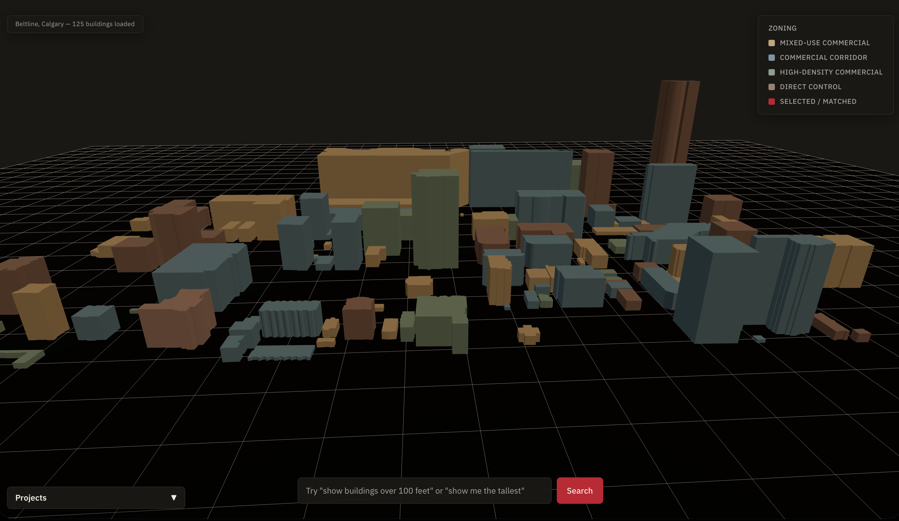
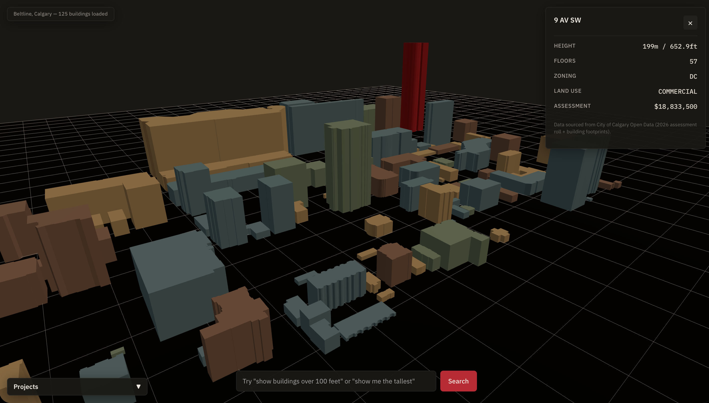
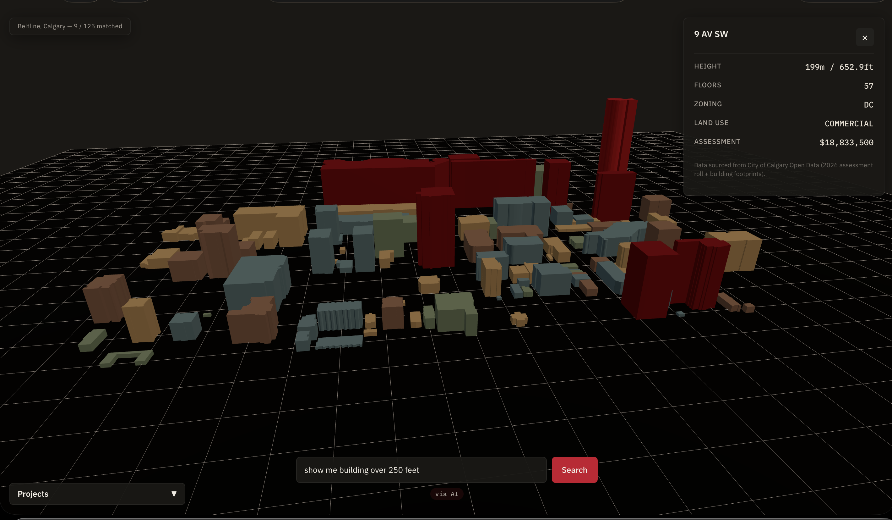
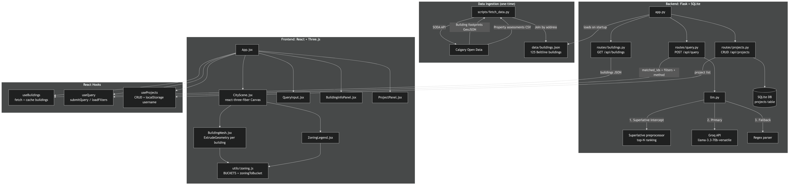
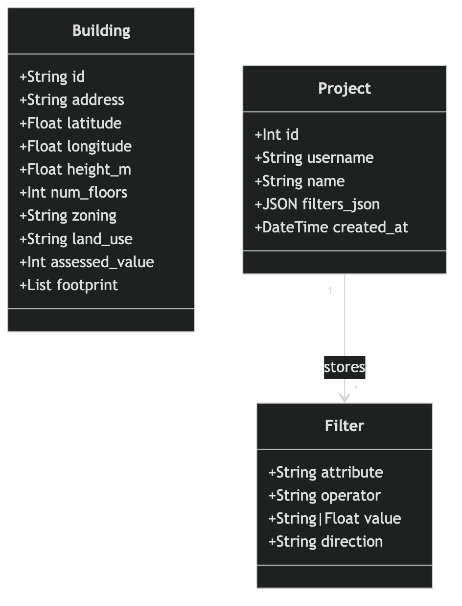
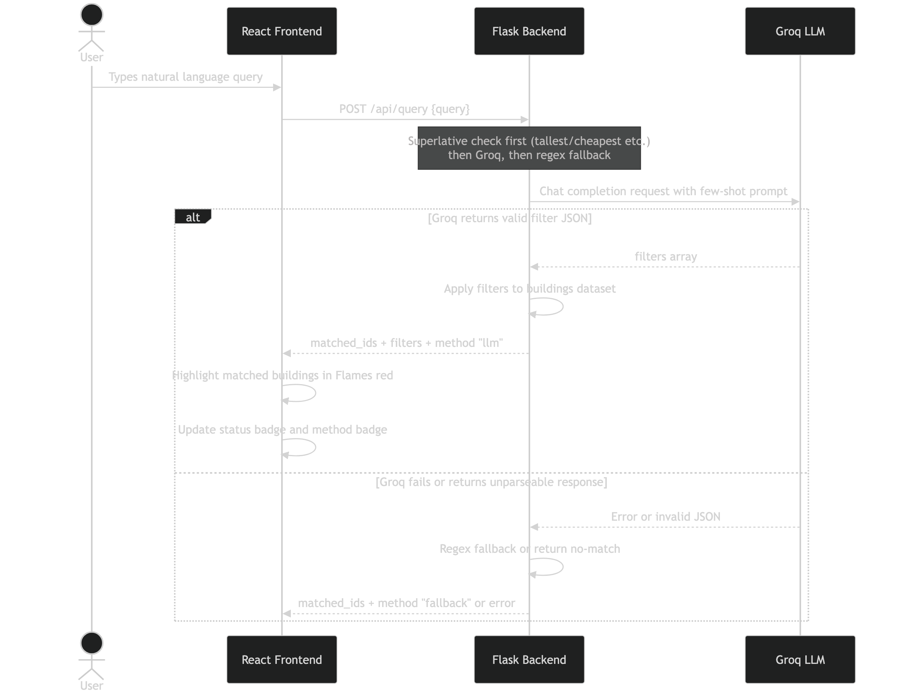

# Calgary 3D Dashboard

A 3D city dashboard for Calgary's Beltline neighbourhood. It renders 125 real buildings from Calgary Open Data as extruded 3D footprints, colored by zoning, with a natural language query interface backed by an LLM.

**Author:** Yuvraj Sondh · April 2026

---

## Live Demo

**[masiv-dashboard.vercel.app](https://masiv-dashboard.vercel.app)**

> The backend runs on Render's free tier and sleeps after 15 minutes of inactivity. The first load may take 20–30 seconds — this is expected. Subsequent interactions are instant.

> Saved projects are stored in memory on the backend instance. They persist for the lifetime of the Render process but reset on redeploy. This is a known limitation of the free tier and is documented in `DECISIONS.md`.

---

## Screenshots

### City overview


### Building inspection


### LLM query active


---

## Features

- **125 real Calgary buildings** extruded from GeoJSON footprints with real heights from the 2026 assessment roll
- **Zoning color system** — four data-driven buckets (Mixed-use commercial, Commercial corridor, High-density commercial, Direct control) matched to the actual Beltline dataset
- **Natural language queries** via Groq (llama-3.3-70b-versatile) — ask "show buildings over 100 feet", "show CC-X zoning", "most expensive buildings"
- **Superlative queries** — "tallest", "shortest", "most expensive", "cheapest" are intercepted before the LLM and resolved via sort + top-5 ranking
- **Regex fallback** — if Groq is unavailable, a regex parser handles common patterns (height, value, zoning, land use, floor count)
- **Method badge** — every query result reports whether it was answered via AI, pattern match, or superlative
- **Project save/load** — save named query snapshots per username, reload them instantly without re-querying the LLM
- **Orbit controls** — orbit, pan, zoom; click a building to inspect it; click empty space to deselect
- **Zoning legend** — top-right map key, hides when a building is selected

---

## Tech Stack

| Layer          | Technology                                                      |
| -------------- | --------------------------------------------------------------- |
| 3D rendering   | React + Three.js via `@react-three/fiber`                       |
| Backend        | Python 3.12, Flask, SQLAlchemy                                  |
| Database       | SQLite (projects table)                                         |
| LLM            | Groq API — `llama-3.3-70b-versatile`                            |
| Data           | Calgary Open Data (building footprints + 2026 assessment roll)  |
| Fonts          | IBM Plex Sans + IBM Plex Mono via Google Fonts                  |
| Backend host   | Render (free tier)                                              |
| Frontend host  | Vercel                                                          |

---

## Local Setup

### Prerequisites

- Node.js 18+
- Python 3.12+
- A free Groq API key (instructions below)

---

### 1. Get a Groq API key

The LLM query feature requires a Groq API key (free tier — no credit card required).

1. Go to [console.groq.com](https://console.groq.com) and sign up
2. Navigate to **API Keys** → **Create API Key** → copy the key
3. Paste it into `backend/.env` in step 2 below

> The app works without a key — it falls back to the regex parser for common query patterns. Superlative queries (tallest, cheapest, etc.) also work without it.

---

### 2. Backend setup

```bash
cd backend

python3 -m venv venv
source venv/bin/activate          # Windows: venv\Scripts\activate

pip install -r requirements.txt

cp .env.example .env
```

Edit `backend/.env`:

```env
LLM_PROVIDER=groq
GROQ_API_KEY=your_groq_api_key_here
GROQ_MODEL=llama-3.3-70b-versatile
FRONTEND_URL=http://localhost:5173
```

Start the backend:

```bash
python app.py
```

The API will be available at `http://localhost:5000`. Building data is pre-cached in `backend/data/buildings.json` — no external API calls needed to load the scene.

---

### 3. Frontend setup

In a new terminal:

```bash
cd frontend
npm install
npm run dev
```

Open [http://localhost:5173](http://localhost:5173) in your browser.

---

### Environment variables reference

| Variable          | Required        | Default                       | Description                              |
| ----------------- | --------------- | ----------------------------- | ---------------------------------------- |
| `LLM_PROVIDER`    | No              | `huggingface`                 | Set to `groq` to enable the LLM          |
| `GROQ_API_KEY`    | For LLM queries | —                             | Your Groq API key                        |
| `GROQ_MODEL`      | No              | `llama-3.3-70b-versatile`     | Groq model ID                            |
| `FRONTEND_URL`    | No              | `http://localhost:5173`       | CORS origin(s) — comma-separated for prod|
| `DATABASE_URL`    | No              | `sqlite:////tmp/projects.db`  | SQLAlchemy database URL                  |

---

## How it works

### Query pipeline

Every natural language query goes through three stages in order:

1. **Superlative check** — queries containing "tallest", "shortest", "most expensive", "cheapest" etc. are intercepted before the LLM. The backend sorts the dataset by the relevant attribute and returns the top 5 results directly. This exists because LLMs don't know the dataset's value distribution and produce nonsense filters for ranking queries.

2. **Groq LLM** — all other queries are sent to Groq with a structured prompt and few-shot examples. The model extracts a filter array (attribute, operator, value). Filters are validated before use.

3. **Regex fallback** — if Groq is unavailable or returns an unparseable response, a hand-written regex parser handles the most common patterns: height comparisons, assessed value comparisons, zoning codes, land use categories, and floor counts.

The method badge on the query bar always shows which path answered the query: **via AI**, **via pattern match**, **via superlative**, or **no match**.

### Building colors

Buildings are colored by Calgary zoning code, grouped into four data-driven buckets:

| Bucket                   | Codes           | Color      |
| ------------------------ | --------------- | ---------- |
| Mixed-use commercial     | CC-X, CC-MHX    | Warm sand  |
| Commercial corridor      | CC-COR, C-COR1  | Dusty blue |
| High-density commercial  | CC-MH           | Sage green |
| Direct control           | DC              | Clay rose  |

Selected buildings (click) and query-matched buildings both use Calgary Flames red — the single accent color of the UI. The full visual system is documented in `DESIGN_SPEC.md`.

### Data

Building data was fetched once via Calgary's SODA API (`scripts/fetch_data.py`) and committed as `backend/data/buildings.json`. The file contains 125 Beltline buildings with footprint geometry, heights, zoning codes, land use, and 2026 assessed values. The app reads this file on startup — no live API dependency.

---

## Project structure

```
masiv-dashboard/
├── backend/
│   ├── app.py                  # Flask app, CORS, startup loader
│   ├── config.py               # Environment variables
│   ├── models.py               # SQLAlchemy Project model
│   ├── llm.py                  # Groq client, superlative preprocessor, regex fallback
│   ├── requirements.txt
│   ├── data/
│   │   └── buildings.json      # Pre-fetched Beltline building data
│   ├── scripts/
│   │   └── fetch_data.py       # One-time data ingestion script
│   └── routes/
│       ├── buildings.py        # GET /api/buildings
│       ├── query.py            # POST /api/query
│       └── projects.py         # CRUD /api/projects
├── frontend/
│   └── src/
│       ├── App.jsx             # Root component, layout, wiring
│       ├── api/                # Fetch clients (buildings, query, projects)
│       ├── hooks/              # useBuildings, useQuery, useProjects
│       ├── components/
│       │   ├── CityScene.jsx        # Three.js canvas, lighting, ground
│       │   ├── BuildingMesh.jsx     # Per-building extruded mesh
│       │   ├── BuildingInfoPanel.jsx
│       │   ├── QueryInput.jsx
│       │   ├── ProjectPanel.jsx
│       │   └── ZoningLegend.jsx
│       └── utils/
│           ├── geo.js          # lat/lon → Three.js XZ conversion
│           └── zoning.js       # BUCKETS array + zoningToBucket()
├── docs/
│   ├── screenshots/            # overview.png, inspection.png, query.png
│   └── uml/                    # Architecture, class, and sequence diagrams (PNG + .mmd source)
├── DESIGN_SPEC.md              # Visual design specification
└── DECISIONS.md                # Engineering decisions and rationale
```

---

## Design decisions

A few choices that may look unusual — from `DECISIONS.md`:

**Data is pre-cached, not live.** Calgary's SODA API can be slow and unreliable. The fetch script runs once, the JSON is committed, and the app reads from disk. No demo breakage from third-party availability.

**The LLM has two fallbacks.** Groq runs first. If it fails, regex handles common patterns. If regex fails, a friendly error is shown. The method badge is always visible so the behavior is transparent, not hidden.

**Superlatives get their own code path.** "Tallest" sent to an LLM produces `height > 0` (everything matches). Instead, the backend detects superlative keywords before the LLM call, sorts the dataset, and takes the top 5. Marked as "via superlative" in the UI.

**Zoning buckets are data-driven.** The Beltline slice has exactly 6 unique zoning codes — all commercial variants plus DC. The legend shows 4 buckets that match what's actually in the scene, not a generic 5-bucket template where 3 buckets would render nothing.

**Designed before styled.** `DESIGN_SPEC.md` was written before any styling. Calgary Flames red as the accent (local reference), IBM Plex as the typeface (built for engineering software). Every color in the codebase traces back to that spec.

---

## UML diagrams

Full-resolution diagrams are in `docs/uml/`.

### Architecture


### Class diagram


### Sequence diagram — LLM query flow


---

## Known limitations

- **Desktop only** — the 3D canvas is not optimized for mobile viewports
- **Saved projects are ephemeral** — on the free Render tier, the SQLite database resets on redeploy. A production deployment would use a managed database.
- **No tests** — given the 36-hour timeline, pytest coverage for the regex parser and superlative logic would be the first addition
- **Beltline only** — the dataset covers one Calgary neighbourhood. Expanding coverage would require re-running `scripts/fetch_data.py` with wider bounding box parameters
- **Composite superlative queries** — "tallest commercial building" is not yet supported; the superlative preprocessor runs before comparison filters are applied

---

*Data sourced from City of Calgary Open Data — 2026 assessment roll and building footprints.*
